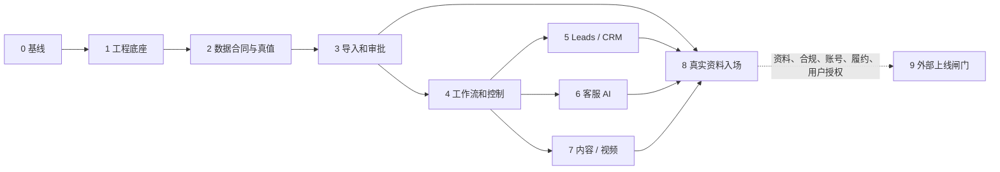

# AI Native Sales OS｜Phase 0–8 工程实施总蓝图

> **文档状态：PLANNED / RECOMMENDED（2026-08-06）**
> **本轮完成度：工程实施蓝图、任务依赖图和 Codex 执行卡已规划；系统代码、数据库、账号、真实资料和外部动作均未实施。**
> 业务状态仍以 [`../project/BUSINESS_STATUS.md`](../project/BUSINESS_STATUS.md) 为准：汾酒处于尼泊尔 TikTok 线上销售准备和供应链资料收集阶段，商品、价格、库存、资质、账号、收款、履约与酒类平台边界仍是 `UNKNOWN` 或 `BLOCKED`。

## 1. 这次规划纠正的层级

仓库已存在 GPT Project / GitHub / Codex 的治理与交接机制；它们是本系统的**控制平面**，而不是运行时销售系统。本蓝图在不推翻该机制的前提下，定义业务运行层如何从空白工程底座走到“真实供应链资料可受控接入、批准真值可被内部模块读取、全链技术回归通过”的状态。

本计划的最终技术目标不是“自动公开销售”，而是让未来资料到达后的主路径固定为：

```text
受控接收 → 原始归档 → AI 提取/清洗 → 映射建议 → 缺失与冲突检查
→ 人工批准 → approved 真值 → fixture 退役（保留测试）→ 模块刷新
→ 全链回归 → 受控内部演示 → run-ready 报告
```

任何外部发布、投放、报价、收款、下单、退款或履约仍只能由 Phase 9 的独立证据和用户授权解锁。

## 2. 已确认基线与本轮不做事项

| 项目 | 当前结论 | 本计划处理方式 |
|---|---|---|
| 治理机制 | `CONFIRMED`：项目入口、事实分级、P0/P1/P2、Git 闭环和 GPT Project 机制包已存在 | 承接；运行时系统不得改写业务事实或绕过机制。 |
| 工程资产 | `部分成立`：规划文档中引用 HappyHorse / DashScope、FFmpeg、DOCX/XLSX 和公开研究生成脚本；但 P00-01 未在当前受控 Git 清单中定位 HappyHorse / DashScope / FFmpeg legacy 实体 | 保持 `DEFER/BLOCKED`；Phase 7 或 P00-03 必须先在授权位置定位实体、记录 hash/CLI 和 dry-safe 行为，才能包装。 |
| 运行时工程 | `CONFIRMED`：尚未发现 `apps/`、`core/`、`modules/`、数据库 migration 或可运行服务 | Phase 1 起由后续 Codex 逐任务建设。 |
| 真实供应链资料 | `UNKNOWN / BLOCKED`：无可批准 SKU、价格、库存、资质、账号、收款或履约事实 | 只使用显式 synthetic fixture；Phase 8 才定义真实资料入场。 |
| 业务线 | `CONFIRMED`：汾酒与海鲜可共享代码/合同，不可共享真值、客户或业务结论 | 每个实体强制 `tenant_id/project_id/business_line_id` scope。 |
| 旧 B2B / 多平台 / 自动外联 | 当前汾酒范围外 | 仅作为共享平台的 disabled / draft-only 能力，永不默认发送。 |

本轮没有创建业务代码、数据库、Docker 服务、账号连接、网络采集、模型调用或供应链数据副本。`.env`、`research_channels.json`、原始资料、媒体、`outputs/`、AppleDouble `._*` 均继续不进入 Git。

## 3. 冻结的路线与 ADR

**RECOMMENDED：** `Python + FastAPI + PostgreSQL + 可替换队列 + 极简 approval UI` 的模块化单体；`adapter-first`、`fixture-first but production-separated`、`human-in-the-loop`、`audit-by-default`。

详细决定见 [ADR-AINOS-0001](adr/ADR-AINOS-0001-modular-monolith-adapter-first.md)。只有 `approved` 且未过期、无冲突、带来源/版本/人工审批的真值能被客服、内容、CRM 和视频模块读取。AI 可以提取、清洗、归类、去重、评分和起草；它不能把候选事实升级为正式价格、库存、资质、外发或订单。

## 4. Phase 0–9 总图

| Phase | 目的 | 严格前置 | 可并行关系 | 完成边界 |
|---|---|---|---|---|
| 0 | 工程事实审计与实施基线 | 当前仓库事实 | 无 | 冻结可复用资产、禁区、ADR 与第一批入口。 |
| 1 | 模块化单体工程底座 | 0 | 无 | 空环境可启动、配置/日志/测试/feature flag/健康检查可用。 |
| 2 | 核心数据合同、真值中心与隔离 | 1 | 无 | 数据合同、scope、版本、状态与审计护栏可测试。 |
| 3 | 导入、清洗、映射、审批与版本链 | 2 | 与 Phase 4 的低耦合文档/contract 准备可并行；实现上先 2 | synthetic 资料能幂等进入候选、审批和 approved 真值。 |
| 4 | 工作流、人工闸门、权限、审计与可观察性 | 2；审批对象实现依赖 3 | 5/6/7 只能在 4 的 policy/approval contract 冻结后并行 | 自动动作被统一 policy、审批、重试、审计和 feature flag 控制。 |
| 5 | 公开资料、线索、CRM 与外联草稿 | 2、4 | 可与 6、7 并行 | 仅公开候选与草稿；真实采集/发送仍关闭。 |
| 6 | 客服 AI、会话状态与人工接管 | 2、4 | 可与 5、7 并行 | 只读 approved 真值、draft-only、强制高风险转人工。 |
| 7 | 内容和视频生产链服务化 | 2、4；legacy 实体定位与回归基线来自 0/7 | 可与 5、6 并行 | 默认 fake provider；仅在 legacy 实体已定位、hash/CLI 可回读且 dry-safe 后包装，所有成片先内部审批。 |
| 8 | 真实资料入场、fixture 替换、全链回归与受控运行 | 3、4、5、6、7；真实资料到达 | 不可与尚未验收的上游并行 | 技术 `run-ready`，不代表外部业务已获准。 |
| 9 | 正式外部上线闸门 | 8 + 外部书面证据 | 不属于本轮实施目标 | 只定义阻断；不写成当前可执行。 |



## 5. 文档导航：单一职责，不重复堆叠

| 需要回答的问题 | 规范文件 |
|---|---|
| 阶段依赖、第一批顺序、并行边界 | [PHASE_0_TO_8_EXECUTION_MAP.md](PHASE_0_TO_8_EXECUTION_MAP.md) |
| 目录、依赖、运行命令、legacy 兼容 | [ARCHITECTURE_AND_MODULE_BOUNDARIES.md](ARCHITECTURE_AND_MODULE_BOUNDARIES.md) |
| 当前官方开源核验、适配与退出 | [OPEN_SOURCE_SELECTION_AND_EXIT_STRATEGY.md](OPEN_SOURCE_SELECTION_AND_EXIT_STRATEGY.md) |
| 字段、约束、状态、权限与保留 | [CORE_DATA_CONTRACTS.md](CORE_DATA_CONTRACTS.md) |
| 导入/清洗/映射/人工批准链 | [INGESTION_MAPPING_APPROVAL_PIPELINE.md](INGESTION_MAPPING_APPROVAL_PIPELINE.md) |
| workflow、审批、RBAC、审计、可观测性 | [WORKFLOW_APPROVAL_AUDIT_DESIGN.md](WORKFLOW_APPROVAL_AUDIT_DESIGN.md) |
| Leads、CRM、草稿外联 | [LEADS_CRM_IMPLEMENTATION_PLAN.md](LEADS_CRM_IMPLEMENTATION_PLAN.md) |
| 客服问答与人工接管 | [CUSTOMER_SERVICE_AI_IMPLEMENTATION_PLAN.md](CUSTOMER_SERVICE_AI_IMPLEMENTATION_PLAN.md) |
| 内容与 HappyHorse / FFmpeg 服务化 | [CONTENT_VIDEO_SERVICEIZATION_PLAN.md](CONTENT_VIDEO_SERVICEIZATION_PLAN.md) |
| 真实供应链资料的标准入场动作 | [REAL_SUPPLIER_DATA_ONBOARDING_RUNBOOK.md](REAL_SUPPLIER_DATA_ONBOARDING_RUNBOOK.md) |
| 验收、回归、降级与 rollback | [TEST_ACCEPTANCE_ROLLBACK_MATRIX.md](TEST_ACCEPTANCE_ROLLBACK_MATRIX.md) |
| `run-ready` 的固定报告格式 | [RUN_READY_REPORT_TEMPLATE.md](RUN_READY_REPORT_TEMPLATE.md) |
| 可直接下发的任务卡索引 | [CODEX_EXECUTION_INDEX.md](CODEX_EXECUTION_INDEX.md) |
| CI/工具可读取的任务依赖图 | [implementation_plan.yaml](implementation_plan.yaml) |

旧的 `CODEX_EXECUTION_PACK.md`、`PHASED_ROADMAP_AND_ACCEPTANCE.md`、`VERTICAL_WORKFLOWS.md`、`OPEN_SOURCE_SELECTION_MATRIX.md` 与 `TEST_AND_ROLLBACK_STRATEGY.md` 保留为早期候选材料；本蓝图中的上述文件是 Phase 0–8 的权威执行入口，旧材料不得与新编号混用。

## 6. 统一执行入口（未来实现，不代表命令当前存在）

```text
make bootstrap
make dev-up
make dev-down
make migrate
make load-fixtures
make ingest FILE=<private-path> BUSINESS_LINE=fenjiu
make inspect-ingestion JOB_ID=<id>
make approve-ingestion JOB_ID=<id>
make regression
make demo-run BUSINESS_LINE=fenjiu
make run-ready-report BUSINESS_LINE=fenjiu
```

`FILE` 必须指向私有受控目录，不会被复制进 Git；`BUSINESS_LINE=fenjiu` 只是运行范围，不说明该业务线已可外部销售。Phase 1 的任务会评估 Makefile 与 `uv run` / `docker compose` 是否能保持等价入口；若替代，必须保留以上易理解命令语义。

## 6A. P00-02 冻结边界（Phase 1 前生效）

本节承接 P00-01 审计结果，冻结 Phase 1 的工程入口；它不创建代码、数据库、依赖锁或运行时目录。

| 冻结项 | Phase 1 可执行边界 | 禁止重新决定 |
|---|---|---|
| 目录 ownership | `apps/` 只放 API/worker/admin 入口；`core/domain` 与 `modules` 放业务规则；`core/application` 放 use case/ports；`core/contracts` 放可版本化 contract；`adapters` 只放 provider 实现；`workflows` 只编排 application ports；`fixtures` 只允许 synthetic | 不在 Phase 1 重新讨论微服务、双真值、直接 SaaS 核心或跨模块读私表。 |
| 依赖方向 | `apps/workflows -> core/application -> core/domain/modules/contracts`；`adapters -> ports/contracts`；domain/modules 不导入 provider SDK | 不允许 domain/modules 直接导入 LangGraph、Crawl、CRM、support、video、模型或支付 SDK。 |
| 外部动作 | `external_execution_allowed=false`、`public_publish=false`、`real_quote=false`、`payment=false`、`order_create=false` 作为默认拒绝 | 不用技术测试、fixture 或 admin 页面打开公开发布、真实报价、收款、订单或履约。 |
| legacy | HappyHorse / DashScope / FFmpeg 在受控 Git 中未定位，状态为 `DEFER/BLOCKED` | 不把规划引用写成现成可用；不选定真实 provider 或未核验版本。 |
| 依赖版本 | Phase 1 可建立 port/fake 和最小本地入口；外部组件只保留 `RECOMMENDED/DEFER/NEEDS_VERIFY` 状态 | P00-02 不冻结 LangGraph/Crawl/CRM/support/video 的具体版本、账号、部署拓扑或 provider。 |

Phase 1 的文件级入口固定见 [架构与模块边界](ARCHITECTURE_AND_MODULE_BOUNDARIES.md) 的 “Phase 1 文件级入口冻结”。若 P01-01 发现目录名、配置入口或测试入口与当前仓库冲突，必须回到 Phase 0 记录差异，而不是在实现中静默换架构。

## 7. Phase 8 的三层状态，绝不合并表述

| 状态 | 定义 | 可做什么 | 不能据此推断 |
|---|---|---|---|
| `technical_ready` | 系统在受控环境可启动、回归和 rollback（即“技术系统就绪”） | 内部 demo、报告、审计 | 数据已正确或可销售。 |
| `data_ready` | 指定业务线资料已来源化、映射、通过质量检查并 `approved`（即“数据可用”） | 客服/内容/CRM/视频读取 approved 真值做内部草稿 | 平台、合规、账号、收款和履约已允许。 |
| `business_external_ready` | 所有 Phase 9 书面证据、feature flag 和用户授权共同满足 | 仅在明确白名单范围执行外部动作 | 已产生订单、销售成功或履约完成。 |

默认：前两个状态都为 `false`；`business_external_ready` 永久默认 `false`。运行时策略字段 `external_execution_allowed` 也永久默认 `false`，它只能作为最后一层拒绝，不能自行把状态改为就绪。

## 8. Phase 9：只规划的外部上线阻断

Phase 9 不能由技术测试自动开启。未来每一项需要来源、日期、责任人、批准记录、feature flag 和用户明确授权：当地销售主体/许可/品牌授权；TikTok 当前酒类内容、广告、外链与直播边界；账号主体与管理员权限；真实价格、库存、配送、退款、售后与结算；收款与订单路径；年龄与地域限制；数据处理与外发授权。任一缺失保持 `BLOCKED`。

## 9. 本蓝图完成的验收

- Phase 0–8 各有依赖、3 个独立任务卡、验证、回退与阻断条件。
- Phase 8 将真实资料接入收束为标准运行路径，而非再次系统设计。
- 存在机器可读依赖图，所有高风险外部动作默认 feature flag `off`。
- 文档中不含 SKU、价格、库存、账号、收款、资质或履约的虚构业务事实。
- 技术 `run-ready`、供应链确认、平台/合规允许、真实订单和履约是不同状态。
