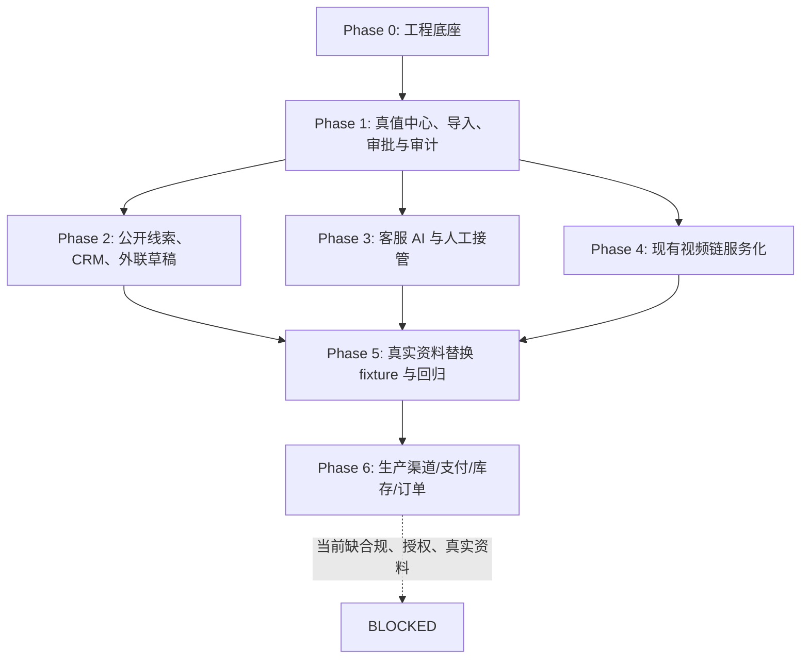

# AI 原生销售操作系统｜纵向落地总计划

> **文档状态：PLANNED / RECOMMENDED（2026-08-06）**
> 本文完成的是可执行工程规划，不代表系统已开发、组件已接入、任何账号已连接，或汾酒/海鲜已获公开销售与履约资格。

## 1. 一句话结论

推荐以 **模块化单体 + PostgreSQL 真值中心 + adapter-first + fixture-first + human-in-the-loop** 建设共同技术底座；先跑通内部模拟闭环，再按业务线隔离地接入真实资料和受控渠道，绝不把第三方 SaaS、模型或采集器当成业务真值。

## 2. 本计划解决与不解决什么

### 本计划解决

- 把“供应链真值、资料导入、线索、CRM、客服、内容/视频”横向能力拆为可顺序验收的纵向闭环。
- 让未来真实 Excel、DOCX、PDF、图片、文件夹或接口资料进入系统时，主要发生字段映射、适配器补充、fixture 替换和全链路回归，而不是推倒重写。
- 为后续 Codex 工作保留小任务、清晰文件范围、审计证据、人工闸门和可逆回退。

### 本计划明确不做

- 本轮不写业务代码、数据库 migration、生产集成、真实网页采集或账号连接。
- 不外发、不群发、不发布、不投放、不自动报价、不退款、不下单、不收款。
- 不将研究数据、候选商品、历史公开名单、模拟价格或供应链模板升级为真实业务事实。

## 3. 当前事实基线与影响面

| 项目 | 审计结论 | 规划影响 |
|---|---|---|
| 仓库与远端 | 本地工作树在 `docs/ai-native-sales-os-plan`，基线为 `main` 的 `c1a3bab`；远端 HEAD/默认分支仍指向 `chore/project-collaboration-system` 的 `952889d`，不是本地当前分支 | 本计划只在独立文档分支写入；任何实施阶段先重新核验 default branch、visibility 与 remote HEAD |
| 当前业务状态 | 汾酒仍是 `research_and_partner_readiness` 等价的供应链准备状态；SKU、价格、库存、主体、授权、账号、收款、履约均未获当前书面确认 | fixture 可用于内部测试；外部动作、真实报价、订单、支付与发布继续 BLOCKED |
| 视频 | HappyHorse/DashScope 任务提交、轮询/断点续跑、下载、质量重试和 FFmpeg/字幕合成已有脚本 | 只封装为 video adapter/job，不重写生成链；先保留现有文件和验收语义 |
| 找客 | `build_research_channels.py` 将人工转录的公开目录名单生成 JSON；不是持续采集服务 | 新 leads 模块从 source snapshot、采集策略、去重和审计做起；旧 JSON 只能作为隔离 fixture/研究输入 |
| 客服 | 海鲜资料中有 FAQ、人工接管与禁止承诺设计，但没有消息入口、会话存储、知识查询或审批运行链 | 把规则移入可版本化 policy 与 approved facts；不把 Word/Python 常量直接当线上知识库 |
| 仓库安全 | `.gitignore` allowlist 仅跟踪机制与文档；`.env`、媒体、输出、原始研究/资料默认不进 Git；外置盘存在 `._*` AppleDouble 元数据 | 新实现目录必须先更新忽略规则和同步包 allowlist；真实文件使用受控对象存储/本地私有目录，不进入仓库 |

证据入口：[`AGENTS.md`](../../AGENTS.md)、[`PROJECT_ENTRY.md`](../../PROJECT_ENTRY.md)、[`BUSINESS_STATUS.md`](../project/BUSINESS_STATUS.md)、[`COLLABORATION_STATUS.md`](../collaboration/COLLABORATION_STATUS.md)、[`build_research_channels.py`](../../build_research_channels.py)、[`generate_happyhorse_shots.py`](../../generate_happyhorse_shots.py)、[`assemble_final_video.py`](../../assemble_final_video.py)。

## 4. 导航：八份实施材料

| 需要回答的问题 | 对应文档 |
|---|---|
| 系统为何这样切、什么可复用、什么不能进运行时 | [架构与模块边界](ARCHITECTURE_AND_MODULE_BOUNDARIES.md) |
| 哪些开源组件可用、为什么可替换 | [开源组件选型矩阵](OPEN_SOURCE_SELECTION_MATRIX.md) |
| 数据如何隔离、哪些字段可由 AI 修改 | [核心数据合同](CORE_DATA_CONTRACTS.md) |
| 五条业务链如何运行和失败回退 | [纵向工作流](VERTICAL_WORKFLOWS.md) |
| 各 Phase 的目标、验收、停止与回退 | [分阶段路线与验收](PHASED_ROADMAP_AND_ACCEPTANCE.md) |
| 可直接复制下发的 Codex 任务卡 | [Codex 执行包](CODEX_EXECUTION_PACK.md) |
| 测试、质量闸门、替换与回滚 | [测试与回滚策略](TEST_AND_ROLLBACK_STRATEGY.md) |
| 这条架构建议的 ADR | [ADR-AINOS-0001](adr/ADR-AINOS-0001-modular-monolith-adapter-first.md) |

## 5. 总体依赖图

`P2`、`P3`、`P4` 在 `P1` 完成后可并行，但每条只能访问本业务线已批准的真值版本。`P6` 不是“等时间到了就开始”，而是每一项受控集成分别通过书面证据、合规、权限、人工验收和回滚演练后才可解除 BLOCKED。

## 6. 设计原则与不可越界规则

1. **真值唯一，输入可多样。** 供应链原始文件、模型输出和第三方系统都不是事实；只有带来源、版本、状态与批准记录的 `approved_fact` 可被客服、内容或对外草稿读取。
2. **业务线共享代码，不共享业务事实。** 每个业务记录强制带 `tenant_id`、`project_id`、`business_line_id`；禁止跨线查询和默认兜底。
3. **AI 提议，人负责不可逆动作。** AI 可提取、归类、去重、评分、起草；价格、库存、合规、外发、发布、退款、合同和订单必须走 policy 与人工批准。
4. **先小闭环，后宽集成。** 每 Phase 的退出条件是可运行且可复盘的最小闭环，不是某个模块“页面做完”。
5. **adapter 只承载外部变化。** 数据库核心领域不依赖 LangGraph、Crawl4AI、Twenty、Chatwoot、模型 SDK 或视频 API；更换外部组件只改 adapter 和契约测试。
6. **fixture 可运行但不可伪装。** 所有 fixture 必须显式 `data_state=fixture`、`is_synthetic=true`、`non_production=true`，且运行时拒绝其进入生产/外发动作。

## 7. 当前代码成熟度矩阵

| 能力 | 成熟度 | 当前可复用部分 | 缺口与实施位置 |
|---|---|---|---|
| 项目协作/事实边界 | **可复用（高）** | AGENTS、状态、风险、同步包、任务模板 | 将实施工程 handoff 与现有项目事实入口关联，但不要把业务状态改写为系统上线 |
| 文档/XLSX/DOCX 输出 | **工具级（中）** | `build_*_docs.py`、供应链清单生成与 QA | 作为资料导入 fixture 与文档解析的参考；不是 runtime service |
| 视频生成与合成 | **原型工具链（中高）** | HappyHorse、状态文件、重试、下载、FFmpeg、字幕、QC | 增加 manifest contract、job adapter、队列与人工审批，不改原脚本语义 |
| 公开名单 | **研究/生成工具（低）** | 来源分级、人工转录、JSON/XLSX 生成、公开来源约束 | 增加受控采集、快照、robots/条款策略、去重、审核、拒绝联系与 CRM 写入 |
| CRM | **规则设计（低）** | 海鲜资料中的阶段、字段、人工边界 | 领域模型、数据库、互动时间线、任务、审计、导出/迁移 |
| 客服 AI | **策略设计（低）** | FAQ、人审、禁止承诺清单 | 消息 adapter、会话、检索、policy、草稿、handoff、审批后台 |
| 数据/任务平台 | **缺失** | 无 | PostgreSQL、后台 worker、队列、migration、observability、secrets 配置 |

## 8. 进入实施前的固定核验

每个执行任务必须先重新读取：

1. [`AGENTS.md`](../../AGENTS.md)、[`PROJECT_ENTRY.md`](../../PROJECT_ENTRY.md)、[`BUSINESS_STATUS.md`](../project/BUSINESS_STATUS.md)、[`SOURCE_OF_TRUTH.md`](../project/SOURCE_OF_TRUTH.md)、[`SCOPE_AND_BOUNDARIES.md`](../project/SCOPE_AND_BOUNDARIES.md)。
2. 当前 `git status --short --branch`、`git remote -v`、`git ls-remote --symref origin HEAD` 与目标分支远端文件。
3. 业务线、数据分类、是否使用 fixture、是否触发人工批准和是否仍被公开执行闸门阻断。

若发现真实客户资料、密钥、未知工作树改动、数据来源冲突、生产账号或业务授权缺失，任务只能完成安全范围内的工作，并按 [测试与回滚策略](TEST_AND_ROLLBACK_STRATEGY.md) 报告 BLOCKED。

## 9. 规划完成后的下一步

第一批只启动 Phase 0 的小任务：建立隔离工程骨架、环境/fixture 防护与合约测试基线；随后再进入 Phase 1。实际顺序和每张任务卡见 [Codex 执行包](CODEX_EXECUTION_PACK.md#第一批建议下发顺序)。
