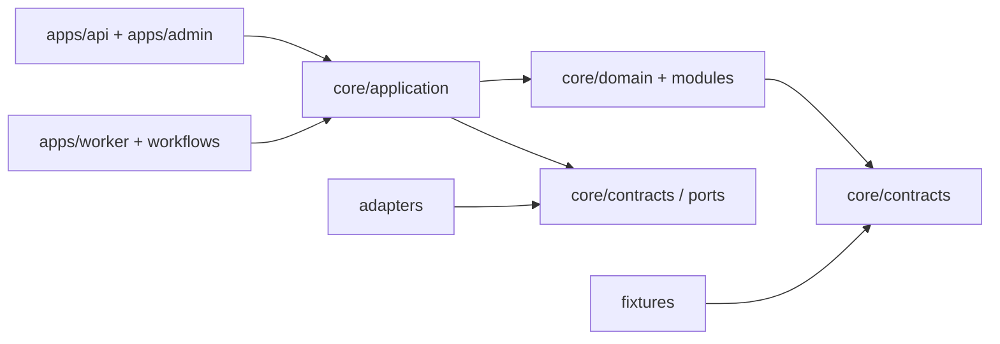

# 架构与模块边界

> **状态：RECOMMENDED，未实施。** 本文是 [总计划](AI_NATIVE_SALES_OS_MASTER_PLAN.md) 的工程蓝图；不改变当前汾酒业务范围或外部执行禁令。

## 1. 建议的第一版形态

采用一个部署单元中的 **模块化单体（modular monolith）**：一个 Python/FastAPI API、一个或多个同代码库 worker、同一个 PostgreSQL、一个队列/缓存服务，以及只做审批与审计的极简 admin。模块之间经 domain service 和 versioned contract 通信，而不是互相读表或调用第三方 SDK。

这不是“永远不拆服务”。满足以下任一证据后才评估拆分：视频 worker 的资源/失败域显著不同；采集工作需要独立的网络隔离；或独立模块已有稳定 API、独立部署需求和可测契约。否则，微服务只会增加部署、可观察性和 Codex 维护成本。

## 2. 目标目录蓝图（实施时创建；本轮不创建代码目录）

```text
apps/
  api/                 # FastAPI: 认证、查询、命令、webhook 接收
  worker/              # 队列 consumer；不暴露业务 HTTP API
  admin/               # 极简审批、审计、导入复核界面；可先 server-rendered
core/
  domain/              # 聚合、policy、状态机、领域事件；零第三方 adapter 导入
  application/         # use cases / command handlers / ports
  contracts/           # Pydantic/JSON Schema、事件版本、错误码
  security/            # tenant scope、RBAC、审计上下文、secret references
modules/
  truth_center/        # 资料、标准化、approved facts、版本、合规素材
  ingestion/           # 文件登记、提取、映射、review、批准
  leads/               # 公共来源快照、提取、去重、评分、审核
  crm/                 # 组织、联系人、机会、互动、拒绝联系、任务
  customer_service/    # 会话、意图、检索、草稿、handoff、policy
  content_video/       # content/video task、事实检查、QC、批准、legacy video port
adapters/
  storage/ database/ queue/ ai/ crawl/ crm/ support/ video/
workflows/             # LangGraph 或等价编排的薄层，仅调用 application ports
schemas/contracts/     # 可导出的 JSON Schema 与跨模块 contract fixtures
fixtures/              # synthetic-only，按 tenant/project/business_line 隔离
migrations/            # 可回放 DB migration；不得含真实数据
tests/                 # unit / contract / integration / e2e / regression
observability/         # logging、metrics、tracing、dashboard 定义
docs/implementation/   # 本计划、ADR、runbook、任务包
docker-compose.yml     # local-only dependencies，禁止承载生产密钥
```

## 3. 依赖方向与禁止项



禁止：

- `core/domain` / `modules` 导入 LangGraph、Crawl4AI、CRM、客服、视频或模型 SDK。
- 一个模块直接读另一个模块的私有表；跨模块只经 application query/command 或事件 contract。
- 外部 webhook 直接写 `approved`、`price`、`inventory`、`crm_stage` 或 `sent` 状态。
- AI 输出直接成为 `approved_fact`、外发消息、公开内容、正式报价、退款/订单决定。
- fixture 从真实资料复制，或在缺 `fixture` 标记时被 worker 加载。

## 4. 模块边界与 ownership

| 模块 | 拥有的数据与命令 | 允许读取 | 禁止做的事 |
|---|---|---|---|
| `truth_center` | source file 引用、事实候选、批准事实、版本、合规文件、素材、禁用表达 | 原始/提取数据、人工批准上下文 | 直接对外发布、接收 CRM 变更、替外部系统作真值 |
| `ingestion` | ingestion job、提取结果、mapping rule、review queue | 文件元数据、解析器、字段合同 | 覆盖原始文件、自动批准冲突字段 |
| `leads` | source snapshot、lead candidate、指纹、评分、审核结论 | 公开来源和允许的 truth facts | 私有数据采集、自动联系、绕过 robots/条款 |
| `crm` | organization、contact、opportunity、interaction、stage、do-not-contact | 已审核 leads、批准后的消息结果 | 覆盖 lead 来源、读取未授权客服文本、修改价格库存 |
| `customer_service` | conversation、message、intent、draft reply、handoff case | approved facts、forbidden expressions、已批准 FAQ | 自动承诺、改真值、绕过人工手动接管 |
| `content_video` | content/video task、script draft、fact check、QC、approval | approved facts、授权素材、legacy video port | 修改原视频脚本、发布内容、把未确认 SKU 写入成片 |
| `adapters` | provider-specific identifiers、sync cursor、retry metadata | ports/contracts | 存放核心业务状态或成为唯一真值 |

## 5. 多业务线隔离

所有可业务化实体必须拥有不可为空的 `(tenant_id, project_id, business_line_id)`：

- `tenant`：数据责任、账号边界和加密/导出授权边界；第一版可以只有内部 tenant，仍要保留字段。
- `project`：一个可审计的目标/环境，如“Fenjiu Nepal preparation”或“Seafood discovery fixture”。
- `business_line`：`fenjiu_nepal` 与 `seafood_nepal` 等；从创建、查询、worker payload 到审计事件均强制传递。

实施建议：PostgreSQL 复合外键/唯一约束、repository 自动 scope、测试中跨线读取必须失败。绝不以页面筛选或提示词代替隔离。真实业务线的运行开关单独配置，默认均为 `disabled`；fixture 不可提升为生产开关。

## 6. Legacy 资产的接入边界

| 现有资产 | 新系统中的位置 | 不能做什么 |
|---|---|---|
| `generate_happyhorse_shots.py`、`generate_happyhorse_video_edit_once.py` | `adapters/video/happyhorse_legacy_port` 的受控 subprocess/manifest adapter | 不复制 API 实现；不把 `.env` 或请求响应写入数据库日志 |
| `assemble_final_video.py`、`prepare_video_assets.py` | 由 content/video worker 调用的 post-process port | 不重写 FFmpeg/字幕流程；不直接发布/覆盖原输出 |
| `build_research_channels.py` | `fixtures/research_channel_fixture` 的来源/字段参考 | 不作为 crawler，不导入真实联系人到 CRM |
| `seafood_project_data.py` | 研究规则、FAQ、字段候选的审计输入 | 不能批量迁移商品、价格、联系人或“首批测试”结论 |
| DOCX/XLSX 生成脚本 | 资料样本与格式回归样本 | 不成为 API/worker 的运行时依赖 |

## 7. 配置、队列、观察性与密钥

- **配置：** 类型化 settings 只读取环境变量/secret reference；仓库只保留 `.env.example` 占位符，禁止密钥值、Cookie、真实 webhook URL。
- **队列：** 所有异步 job 有 idempotency key、attempt count、safe retry policy、dead-letter 状态与业务线 scope；失败不能重复外发或重复创建事实。
- **日志：** JSON log 至少含 `correlation_id`、scope IDs、actor type、command、result、policy decision；不得记录消息全文、密钥、身份证明或私有附件。
- **审计：** 数据变更和批准是 append-only audit event；常规管理员不能删除。更正采用 superseding version，不覆盖历史。
- **本地外置盘：** 开发 compose 的 volume 需相对路径；AppleDouble `._*`、`.DS_Store`、`outputs/`、媒体和临时 PDF/DOCX 继续被 Git 排除。同步包 allowlist 只有在规划完成并通过敏感扫描后才可单独扩展。

## 8. 实施前的架构验收

进入 Phase 1 前，必须证明：目录 skeleton 能在空数据库启动；modules 依赖图无反向 adapter；任一 fixture 不能以 production mode 运行；两个业务线不能跨读；worker 重试是幂等的；审计事件不能因为错误分支缺失。具体测试见 [测试与回滚策略](TEST_AND_ROLLBACK_STRATEGY.md)。
