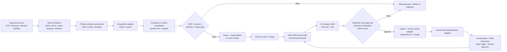

# Phase 8｜Real Acquisition Bridge（真实获客桥接层）技术实施规划

> **文档状态：RECOMMENDATION / PLANNED（2026-08-23）**
> **范围：只读工程审计、开源调研与下一阶段设计；本轮未修改业务代码、数据库、现有 Phase 5–7 合同、真实 API 配置或外部系统。**
> **关键口径：本报告不是“已接入真实获客”的证明，也不授予抓取、联系、发送邮件、处理真实联系人或自动外联的权限。**

## 0. 核心判断

1. **CONFIRMED：Phase 5–7 的安全骨架值得保留，不能用“开启开关”方式变成真实获客。** 现有工作流、幂等、DNC、审批、事实锁、审计、重试/DLQ、人工接管与 `zero-send proof` 是正确的复用点；但 `SourcePolicy`、`CrmRepository` 和 `OutreachDraftService` 都显式限定为 `DataState.FIXTURE`、`is_synthetic=true`，且 `ActionPolicy` 对 `EXTERNAL_SEND` 直接拒绝。
2. **CONFIRMED：现有 P08 与本报告提议的获客桥接不是同一件事。** 既有 `P08-01`～`P08-03` 的定义是“真实供应链资料受控接收、审批、fixture 隔离与内部 run-ready”，其前置依赖仍是 `real_supplier_data_missing`。为避免覆盖或误解，本文把真实获客规划命名为 **`P08-RAB`（Real Acquisition Bridge）扩展轨道**；它必须位于既有 P08 数据治理完成之后，并且不改变 Phase 9 外部业务闸门。
3. **RECOMMENDATION：主路线应是“受控来源 + 人工审核 + Gmail adapter + 回复闭环”，而不是一开始做全自动 Agent。** 首个可评估版本只接受有明确来源、用途、条款/授权与留存规则的企业数据；AI 只做提取、去重理由、评分解释和草稿，不能决定可联系性、合规性或发送。
4. **RECOMMENDATION：不要把 Google Maps scraping（抓取）作为数据源。** Google Maps Platform Terms 明确禁止将 Maps Content 抽取、导出或抓取到服务外，也禁止批量下载或保存企业名称、地址、评论等内容。因此，开源 Maps scraper 不能作为本项目的 adapter 候选；未来若有必要，另行进行官方 API 使用场景、条款、留存与法务复核，而不能用浏览器自动化规避条款。
5. **BLOCKED：现在不能开始真实桥接实施。** 当前项目仍缺真实 SKU/价格/库存/资质/账号/收款/履约资料，也没有可审核的数据来源、联系人处理依据、Gmail OAuth 管理员授权、数据保留政策、真实身份/RBAC 与外联授权。本报告的完成不改变这些业务或合规状态。

### 事实来源与分级

| 分级 | 本报告中的含义 |
|---|---|
| **CONFIRMED** | 当前 `main` 中代码、测试、报告或远端 Git 指针直接支持。 |
| **INFERRED** | 基于现有结构推导的实现影响或工作量，尚未由新代码验证。 |
| **UNKNOWN** | 需要用户、供应链、数据提供方、法务、邮箱管理员或平台书面材料确认。 |
| **RECOMMENDATION** | 未来设计选择；未接入、未批准、未实施。 |

本轮 P0 仅授权**规划** Real Acquisition Bridge。`BUSINESS_STATUS.md` 当前仍将“自动找客或自动外联”列为已从正式范围中替代的旧范围；因此，任何实际实施卡开始前，都必须先有新的、可回读的用户范围确认与业务闸门证据。P0 不能自动替代真实外部联系授权。

## 1. 已核验的当前工程状态

### 1.1 Git 与工程基线

| 项目 | 状态 | 证据 |
|---|---|---|
| 工作区 / remote | **CONFIRMED** | 工作区为仓库根目录；`origin` 为 `https://github.com/fthytwerwt-sudo/fenjiu.git`。 |
| 分支与同步 | **CONFIRMED** | `main`；`git pull --ff-only origin main` 返回 `Already up to date`。 |
| 当前本地与远端头 | **CONFIRMED** | `HEAD=origin/main=8420f754fab10352ae628937062a64f92a304cae`。 |
| Phase 5–7 | **CONFIRMED（工程合同）** | 已有 P05/P06/P07 报告、模块与测试；它们只证明 synthetic/local-only 合同，不证明真实数据或外部动作。 |
| 既有 Phase 8 | **BLOCKED** | P08-01 仍要求当前、获授权的真实供应链资料包与来源/范围/版本证据；当前状态为 `real_supplier_data_missing`。 |

### 1.2 模块复用判定

| 模块 / 当前实现 | 当前状态 | 是否可复用 | 真实桥接缺口与处理建议 |
|---|---|---|---|
| `core/contracts/scope.py` | **CONFIRMED**：tenant/project/business-line/correlation scope；敏感 external flags 永久默认 false。 | **部分复用** | 保留 compound scope 与 correlation；新增真实数据分类、联系人处理依据、留存、来源版本和 provider receipt 的版本化合同，不能解除现有 `ExecutionPolicy` 的静态拒绝。 |
| `modules/leads/source_policy.py` | **CONFIRMED**：只接受 synthetic `.invalid` URL；要求 fixture；拒绝 `email`、`phone`、`contact`、social/outreach 字段。 | **不能直接扩展** | 这是 P05 的硬安全合同，应原样保留。新增独立 `modules/acquisition/` 与真实来源 policy，不要把联系字段白名单塞回 P05 `SourcePolicy`。 |
| `adapters/crawl/fake.py` | **CONFIRMED**：零网络 `FakeCrawlPort`，有 hash、evidence locator、audit，`external_fetch_count=0`。 | **模式可复用** | 复用 port/fake/contract-test 形态；新增的 real adapter 必须有独立 process/network boundary、allowlist、速率、robots/terms、证据和停用面，不能替换 fake。 |
| `modules/leads/domain.py` 与 lead review | **CONFIRMED**：synthetic candidate、review、可解释去重候选。 | **部分复用** | 可复用“候选→人工 review→拒绝/merge”流程与 dedupe reason；需要新的 `AcquisitionCompanyCandidate`，不得把真实记录伪装成 `SyntheticLeadCandidate`。 |
| `modules/crm/domain.py` | **CONFIRMED**：organization/contact/opportunity/interaction/DNC/export 均有 scope、hash、审计与合成边界。 | **部分复用** | `DncRegistry` 的不可变、按 scope 的 subject-hash 阻断可优先复用；`CrmRepository`、Organization、Contact 强制 synthetic，需新 real repository/存储 adapter 与最小化 PII vault，不能直接把 `is_synthetic` 改为 false。 |
| `modules/crm/outreach.py` | **CONFIRMED**：只生成内部可编辑草稿；DNC、同意、风险、事实过期均转人工；没有 sender/provider/recipient 表面。 | **模式可复用，不可直连发送** | 复用 fact lock、草稿失效、manual handoff、zero-send proof；新增 `OutboxCommand`、`DeliveryReceipt` 和 Gmail sender port，仍须由外部审批策略拦截。 |
| `core/application/outreach_draft.py` | **CONFIRMED**：审批绑定 subject version 与 DNC，批准结果仅为 `APPROVED_INTERNAL`。 | **部分复用** | 可复用 request/decision/recheck 顺序；真实发送要独立 `SendApproval`，不能把现有 internal approval 当发送授权。 |
| `core/security/action_policy.py` / `feature_flags.py` | **CONFIRMED**：本地/测试环境；外部动作直接 `external_action_forbidden`；flag port 无配置写面。 | **安全原则可复用，代码需新实现** | 生产桥接需要受控、可审计、可撤销的 capability/approval configuration；必须保持 deny-by-default，不能把静态 `FailClosedFeatureFlags` 变成任意环境变量开关。 |
| `core/security/audit.py` / `core/application/retry.py` | **CONFIRMED**：append-only hash chain、安全 metadata、外部或未知副作用不自动重试。 | **高复用价值** | 保留“审计先于成功”、`UNKNOWN_SIDE_EFFECT → MANUAL_REVIEW`、DLQ；补持久化 audit/outbox store、provider receipt hash 和生产保留策略。 |
| `workflows/runner.py` | **CONFIRMED**：幂等、checkpoint、pause/resume、retry/DLQ/manual queue；checkpoint 禁止 body/contact/price/path 等敏感键。 | **高复用价值** | 以 opaque refs 运行 acquisition/send/reply 工作流；不在 checkpoint 或 audit 中写邮箱、正文、附件、联系人、价格。真实 side effect 的成功/未知结果均必须由 provider receipt 对账。 |
| `modules/customer_service/*` 与 `adapters/support/fake.py` | **CONFIRMED**：receive-only fake inbox、opaque external refs、reply draft、DNC/PII/high-risk handoff。 | **高复用价值** | 邮件回复闭环应沿用 inbound envelope、opaque reference、quarantine、人工接管与事实失效模式；另建 Gmail inbound adapter。 |
| `adapters/crm/`、`adapters/queue/`、`adapters/ai/` | **CONFIRMED**：仅空壳 / fake-only metadata。 | **仅目录 ownership 可复用** | 需要新增协议、fake adapter、integration contract；当前没有 broker、CRM SaaS、AI SDK 或生产数据库 adapter。 |

### 1.3 影响面检查

| 问题 | 结论 | 说明 |
|---|---|---|
| Phase 5–7 架构是否需要修改？ | **RECOMMENDATION：不修改其既有安全合同；只新增兼容层。** | P05 的 synthetic/contact deny、P05-03 的 zero-send、P06 的 privacy quarantine、P04 的审计/审批均是回归基线。任何共享抽象先以额外 contract test 证明等价，再小范围提取。 |
| leads / CRM / outreach 能否直接扩展？ | **部分成立：流程语义能复用；当前实体和存储不能直接扩展。** | 目前数据模型 hard-code `DataState.FIXTURE`、`is_synthetic=True`、0 send。真实数据必须走平行 `acquisition` bounded context，再受控进入 real CRM read model。 |
| 是否需要新增 adapter？ | **CONFIRMED：需要。** | 至少是 `source_import`、`website_parser`（可选）、`email_sender`、`email_inbox`、`secret_reference`、persistent queue/audit/outbox；全部先有 fake contract。 |
| 是否需要新增 provider？ | **INFERRED：需要 provider port，但不必先选多个 provider。** | MVP 只建议一个受控 Gmail provider；联系数据 enrichment 和第三方 CRM 都先作为可插拔、默认 disabled 的候选。 |
| 是否影响安全边界？ | **CONFIRMED：显著影响。** | 从 value-free synthetic 进入企业/联系人、OAuth、邮件正文、回信和 retention，必须建立 PII/secret/storage 的新信任边界。 |
| 是否影响真实外部联系能力？ | **CONFIRMED：会影响，且必须 fail closed。** | 发送是新的外部副作用；必须独立于草稿审批，并要求发送前再校验。没有书面授权和所有业务闸门时始终 0 send。 |

## 2. Phase 8-RAB 目标、机制与六层需求确认

### 2.1 目标层

**RECOMMENDATION：** Real Acquisition Bridge 的技术目标是让一个经过批准的企业来源，按可追溯的路径进入内部 CRM，并将“人审后的草稿”在日后受控地交给 Gmail adapter；收到回复后再进入现有会话/人工接管/CRM 反馈链。

```text
已批准企业来源
  → private evidence / provenance
  → company candidate + contact candidate（最小化）
  → DNC / consent / retention / scope gate
  → deterministic score + human review
  → CRM
  → AI draft（仍为内部草稿）
  → send approval + outbox
  → Gmail provider receipt
  → reply intake / thread match
  → CRM interaction + human takeover / next-step queue
```

本阶段不解决：当地酒类合规、商品上市、真实报价、付款、订单、履约；不把“邮件已送达”推论为“客户接受、成交或业务完成”。

### 2.2 机制层：主路径、降级与 fail-closed

| 环节 | 自动化允许的最小动作 | 必须人工批准 / 复核 | fail-closed 条件 |
|---|---|---|---|
| 来源登记 | hash、格式检查、私有引用登记、来源 policy 验证 | source owner、合法性/条款、允许字段、用途、保留期 | 来源、owner、terms/robots/授权、scope、目的、允许字段任一缺失。 |
| 企业解析 | 标准化、domain/名称 fingerprint、证据 locator、候选去重理由 | 同名 merge、企业真实性、类别适配 | 需要登录/CAPTCHA/私有来源、URL 不在 allowlist、意外个人信息或解析不确定。 |
| 联系方式 | 仅在批准的 business-contact 处理规则内解析为 private ref/hash | 处理依据、联系适当性、联系人与公司关联 | DNC、删除请求、缺少处理依据、个人渠道、无法判断归属或来源。 |
| 评分 | 可复现规则分、理由、缺失项 | 阈值、优先级、商机判断 | 模型自行决定可联系、评分理由不可重放、评分依赖未批准敏感数据。 |
| 外联草稿 | 按 approved fact/version 生成草稿、风险标签、事实锁 | 文案、事实、收件人、语言、批次 | DNC、无证据/同意、价格/库存/交期等 facts 过期、冲突或超范围。 |
| 发送 | 无；直到单独发送授权已存在 | user authorization、operator、每封或有限批次批准 | OAuth/secret/flag/approval/recipient/DNC/事实版本任一不满足；provider 结果未知。 |
| 回复 | notification ack、消息 hash/ref、thread match、风险分类 | 真正答复、报价/订单/投诉/隐私请求处理 | 回复无 scope、DNC/删除请求、附件/PII、价格/库存/履约/法律风险、history gap。 |

### 2.3 实现设计层（必须在后续任务卡逐项重申）

| 字段 | Phase 8-RAB 建议 |
|---|---|
| `primary_route` | 受控 CSV / 书面获授权企业目录 / 已批准企业官网的单站 adapter → 人审 → 内部 CRM → Gmail API outbox/inbox bridge。 |
| `fallback_route` | 人工导入来源 + 内部草稿导出给授权人员手动发送；回复通过受控人工导入。fallback 不能绕过 DNC、来源、留存或审批。 |
| `capability_status` | 当前为 `planned_blocked_real_acquisition`；可先实施 fake/sandbox contract，不能启用真实抓取或发送。 |
| `probe_required` | source-policy/terms、PII classification、DNC race、dedupe/merge、provider idempotency、OAuth secret isolation、Gmail send receipt、watch/history replay、reply/thread match、retention/delete、unknown-effect recovery。 |
| `allowed_codex_autonomy` | 在新干净 task worktree 中创建 value-free contracts、fake adapters、migrations、tests、runbooks、audit and dry-run reports；可执行用户已批准的内部验证。 |
| `forbidden_codex_guessing` | 不猜联系人合法性、同意、企业真实性、收件人、邮箱所有权、Gmail OAuth 权限、产品/价格/库存/合规、任何业务授权或 provider 成功结果。 |
| `required_inputs` | 新范围确认；每源书面授权/terms/owner；联系人处理依据与 retention；真实 RBAC/identity 设计；Gmail/Cloud 项目管理员授权；秘密管理方案；供应链/商品事实；发送批准规则与 stop line。 |
| `required_outputs` | 实施 ADR、source register、privacy/data contract、adapter contract tests、fake and sandbox evidence、审计/rollback runbook、明确的 blocked report；不含真实联系人或 secret。 |
| `execution_entrypoints` | 未来建议：`make acquisition-contract-test`、`make acquisition-dry-run SOURCE_REF=<ref>`、`make crm-review CANDIDATE_REF=<ref>`、`make outreach-prepare ...`、`make gmail-sandbox-probe`、`make reply-sync-dry-run`；它们**尚未实现**。 |
| `validation_commands` | 未来建议：现有 `make regression` + acquisition contract/integration/e2e/PII/secret scan；任何 send test 使用 fake/sandbox，且断言 production `external_send_attempts=0`，除非独立的 live-pilot task 已满足所有 gate。 |
| `blocked_if_missing` | 缺来源证据、联系人处理依据、DNC/retention、真实身份/RBAC、secret/OAuth 控制、供应链真值、用户外发授权、平台/当地合规、审计/rollback 或 provider 对账任一项即阻断。 |

### 2.4 流程、判断标准与反馈层

- **流程层（RECOMMENDATION）：** GPT/用户负责业务范围、来源和外发授权判断；Codex 只实现经批准的技术合同并跑验证；人工 reviewer 负责来源、候选、DNC、草稿和发送批准；provider 只返回可核对的 receipt，不成为事实源或审批者。
- **判断标准层：** contract green 只证明技术路径；source accepted 只证明来源可处理；`data_ready` 只证明资料可被内部读取；`sent` 只证明 provider receipt 已保存；客户回复、报价、订单、销售和履约均为独立业务事实。
- **反馈层：** source/terms 不成立回到来源 gate；误合并回到 review/merge；DNC/删除请求回到 privacy/DNC；Gmail 未知结果回到 manual reconciliation；事实过期回到 truth/供应链；外部授权缺失回到用户/合规，而不是重试发送。

## 3. 推荐的总体架构



### 3.1 数据与边界设计

**RECOMMENDATION：采用两个物理/逻辑层，不把真实业务内容放进日志、审计、Git、fixture 或工作流 checkpoint。**

1. **Evidence/PII vault（私有受控层）：** 原始网页/CSV、被允许处理的 business email、原始邮件、附件、OAuth token。仅保存私有 storage reference、加密材料和 key reference；定义保留/删除/访问审计；不能进入 Git、同步包、fixture、普通 log 或 P04 当前 value-free audit metadata。
2. **Operational metadata（Sales OS 层）：** `source_ref`、`candidate_ref`、`contact_ref`、HMAC/hash、scope、来源版本、处理依据 ref、DNC/ref、事实版本、policy version、outbox/ref、Gmail message/thread/history refs 的受控 opaque representation、审计链与统计计数。

建议的未来实体（均为设计，不是现有表）：

| 实体 | 必须的安全字段 | 不能承担的职责 |
|---|---|---|
| `AcquisitionSource` / `SourceVersion` | scope、owner、purpose、terms/robots/authorization refs、allowlist、field policy、retention、status、version/hash | 不保存 raw page/content。 |
| `EvidenceObject` | private locator、content hash、sensitivity、received/retrieved time、origin/ref、quarantine result | 不等于企业真实性、联系人可联系性或 CRM approval。 |
| `CompanyCandidate` | organization fingerprint、source/evidence refs、category/region candidates、confidence/reasons、review state | 不自动变成正式 organization。 |
| `ContactCandidate` | `contact_ref`、contact value HMAC、business association evidence、processing-basis/retention/DNC refs、minimized channel type | 不在普通业务表、log、audit 中复制明文 email/phone。 |
| `LeadScore` | feature-version、input refs、score/reason codes、computed time、override/reviewer ref | 不等于真实商机、客户意愿或发送许可。 |
| `OutboxCommand` / `DeliveryAttempt` | idempotency fingerprint、recipient ref、template/fact/policy versions、approval refs、provider request/receipt refs、state | 不存 mail body/recipient 明文；不在 receipt 前写 `sent`。 |
| `InboundEnvelope` / `ReplyLink` | mailbox/ref、Gmail message/thread/history refs、content hash/private content ref、classification/review state | 不自动生成对外回复。 |

### 3.2 Gmail adapter 的建议边界

**RECOMMENDATION：自行实现极薄的 Gmail adapter，不把 sender 职责交给通用 agent 或 CRM。** Gmail API 的 `users.messages.send` 是真实外部副作用；后续 adapter 只在以下条件同时通过时调用它：

- `SendApproval` 与当前 `subject_version`、联系人、template、fact lock、scope、purpose、批次和有效期精确绑定；审批者与草稿创建者分离。
- 发送时再读取 DNC、删除/opt-out、retention、source/processing-basis、当前资料事实和 capability 状态；任一变化拒绝并写审计。
- token 只以 secret-manager reference 使用；Git、日志、audit、checkpoint、exception 和测试夹具均不可出现 token、邮箱或 raw MIME body。
- outbox 先 durable，再由单一 worker claim；幂等 key 至少覆盖 campaign/recipient/template version/fact versions/approval version；网络超时、API 5xx、receipt 不明都标 `unknown_effect` 并人工对账，绝不自动重发。
- provider 成功后保存 Gmail `message_id` / `thread_id` 的受控 reference 与 receipt hash；仅 provider receipt 能驱动 `sent`，不是 UI 点击或执行日志。
- 回复采用 Gmail `watch` + Cloud Pub/Sub 通知 + `historyId` 增量同步；watch 到期前续订，并对通知丢失做 `history.list` 回补。回补失败/历史缺口进入 manual queue，不丢弃或假定没有回复。

**CONFIRMED（外部资料）：** Gmail API 发送需要 OAuth scope，`users.watch` 返回 `historyId` 与到期时间；官方指南说明 watch 至少每 7 天续订、建议每天续订，并且通知丢失时要有 history 同步降级。实际 scope、Google Cloud 项目、Pub/Sub、邮箱权限与数据处理授权均仍为 **UNKNOWN**。

### 3.3 联系发现与数据最小化

**RECOMMENDATION：第一版只接受“已批准来源中明确出现的 business contact”或手工提供且有处理依据的业务联系人；不做个人邮箱猜测、社交账户枚举、邮箱验证轰炸或跨站拼接。**

可由 adapter 自动处理的是：域名/企业名称规范化、相同公司候选、公开业务字段的结构化、email 语法校验（不等于邮箱存在）、来源证据、DNC lookup、联系人与企业关联的待审理由。不能自动判断的是联系人代表性、同意/合法处理依据、最适合的联系人、可发送性或商业意图。

`theHarvester` 可从公开来源聚合 emails/subdomains/names，但其定位是 OSINT，且为 GPL-2.0；它不应进入 MVP 的生产链。此处保留它仅作为“能力边界与风险的调研对象”，不是推荐的 commercial contact discovery adapter。

## 4. GitHub 开源项目调研与选择

> Star 数由对应直接 GitHub 项目页在 **2026-08-23（Asia/Shanghai）** 观测，见各行 `Snapshot`；数值会变化。许可证和每个锁定版本的依赖许可证必须在实施前重新核验。这里的“可商业使用”仅是许可证工程判断，不构成法律意见，也不替代来源条款、隐私、反垃圾信息、平台或当地酒类合规审查。

### 4.1 Web 数据采集 / browser automation

| 项目 | GitHub / Stars | 许可证与商业适配 | Snapshot | 作为 adapter 的判断 |
|---|---|---|---|---|
| **Crawl4AI** | [unclecode/crawl4ai](https://github.com/unclecode/crawl4ai) · 约 75.9k；Python、异步 browser pool、网页到结构化/Markdown、缓存与 Docker 运行。 | Apache-2.0；许可证层面较友好。 | GitHub repo page · 2026-08-23 | **RECOMMENDATION：候选 primary website parser。** 仅在 approved URL allowlist、robots/terms、低频、无登录/CAPTCHA、独立网络容器和证据落库后，通过 `WebsiteParserPort` 调用。不是全网爬虫，也不可以绕过网站限制。 |
| **Scrapy** | [scrapy/scrapy](https://github.com/scrapy/scrapy) · 约 61.9k；成熟 Python structured crawling framework、spider/pipeline/extension。 | BSD-3-Clause；许可证层面友好。 | GitHub repo page · 2026-08-23 | **RECOMMENDATION：大规模、稳定、静态企业目录的后备候选。** 对 MVP 可能偏重；保持 `CrawlPort`/`WebsiteParserPort` 后可替换，不引入 domain 层。 |
| **Scrapy-Playwright** | [scrapy-plugins/scrapy-playwright](https://github.com/scrapy-plugins/scrapy-playwright) · 约 1.4k；将 Playwright 的 browser-rendering 接到 Scrapy 的 request/pipeline。 | BSD-3-Clause；许可证层面友好。 | GitHub repo page · 2026-08-23 | **RECOMMENDATION：仅在已批准的动态站点需要渲染时选用。** 它是 Scrapy 的渲染补丁层，不是独立 data source 或绕过登录/CAPTCHA 的机制。 |
| **Playwright** | [microsoft/playwright](https://github.com/microsoft/playwright) · 约 95.0k；Chromium/Firefox/WebKit 自动化、隔离 context、trace。 | Apache-2.0；许可证层面友好。 | GitHub repo page · 2026-08-23 | **RECOMMENDATION：动态且明确允许访问的网站的受控 fallback。** 不用于登录墙、CAPTCHA、反爬规避、批量 Maps scraping 或模拟人类以规避条款。建议优先用于 adapter contract/sandbox，而非首个真实来源。 |
| **Crawlee for Python** | [apify/crawlee-python](https://github.com/apify/crawlee-python) · 约 9.5k；Python crawler、request queue、session 管理。 | Apache-2.0；许可证层面友好。 | GitHub repo page · 2026-08-23 | **INFERRED：可作为 Scrapy 的替代性 Python adapter spike。** 在同一份 source-policy/port test 下比较后再选；不要把它和 Node.js Crawlee 一起引入 MVP。 |
| **Crawlee** | [apify/crawlee](https://github.com/apify/crawlee) · 约 25.5k；Node/TypeScript crawler、request queue、Playwright/Puppeteer/HTTP、持久队列。 | Apache-2.0；许可证层面友好。 | GitHub repo page · 2026-08-23 | **INFERRED：可选 adapter service。** 当前仓库是 Python stdlib-first；引入 Node runtime 会显著增加运行面，除非 Crawl4AI/Scrapy 无法满足经批准的源需求，否则不建议 Phase 8 MVP 采用。 |
| **Firecrawl** | [firecrawl/firecrawl](https://github.com/firecrawl/firecrawl) · 约 171.1k；网页转 Markdown/JSON 的 extraction service。 | AGPL-3.0；网络部署与商业使用须先做许可证评估。 | GitHub repo page · 2026-08-23 | **DEFER。** 技术能力匹配，但许可/部署与 provider surface 较重；不在 Phase 8 MVP 引入。 |

**Google Maps / 企业目录结论：NOT_RECOMMENDED。** Google Maps Platform Terms 的 No Scraping 条款禁止将 Maps Content 抽取、导出或抓取到服务外；因此不推荐任何开源 Google Maps scraper、proxy rotation 或 browser automation 方案。企业目录主路线应是数据提供方明确允许的 CSV/export、可证明许可的行业目录或企业自有官网；每个数据源仍要独立 policy。

### 4.2 企业联系方式发现 / enrichment

| 项目 | GitHub / Stars | 许可证 / 商业适配 | Snapshot | 结论 |
|---|---|---|---|---|
| **theHarvester** | [laramies/theHarvester](https://github.com/laramies/theHarvester) · 约 17.2k；OSINT 聚合 emails、subdomains、names，部分模块依赖第三方 API/keys。 | GPL-2.0；copyleft 与来源/个人数据风险高。 | GitHub repo page · 2026-08-23 | **NOT_RECOMMENDED（生产接入）。** 可作为安全评审的反例：其发现结果不构成联系授权、企业归属或外发许可。 |
| **check-if-email-exists** | [reacherhq/check-if-email-exists](https://github.com/reacherhq/check-if-email-exists) · 约 9.5k；邮箱存在性验证，不发现联系人、不提供 phone/website/company profile。 | AGPL-3.0 + commercial license；商用网络部署需单独审查。 | GitHub repo page · 2026-08-23 | **DEFER。** 仅在已经取得合规 business email 后才可能作为 send 前验证 provider；它不能成为获客/联系人来源，也不能绕过 DNC 或联系授权。 |
| **自建 `BusinessContactExtractorPort`** | 无外部仓库依赖；仅解析已批准企业官网/文件中明确出现的 business email、phone、website/company profile；产出 private ref、HMAC、evidence locator 和 `needs_human_review`。 | 自有代码；仍受来源与隐私约束。 | n/a | **RECOMMENDATION：MVP 主路线。** 比全网 enrichment 更小、更可审计，先覆盖 email/phone/website/company profile 的最小字段集。 |
| 商业 enrichment provider | **UNKNOWN**；可能提供 email、phone、company enrichment。 | 与 API/数据许可证、地域、保留/删除、转授权有关。 | provider due diligence required | **DEFER。** 只有完成 data-provider due diligence、DPA/条款/地域/字段/retention/成本审查后，才可实现 `EnrichmentProviderPort`；不把 provider 数据自动写入 CRM。 |

### 4.3 CRM：继续扩展还是接入开源 CRM

| 选项 | 调研结论 | 对当前项目的建议 |
|---|---|---|
| 继续当前 CRM domain | 当前 CRM 已有 scope、DNC、审计、dedupe、retention intent、草稿/事实锁语义，且是未来控制面的一部分；但 storage 是 in-memory/synthetic-only。 | **RECOMMENDATION：继续作为 CRM 真值模型的起点，但在 `acquisition` bounded context 建立真实数据路径和 persistent store。** 先保留本项目 truth/DNC/audit 主导权。 |
| [Twenty](https://github.com/twentyhq/twenty)（约 47.2k） | TypeScript/NestJS/BullMQ/PostgreSQL/Redis 的完整 CRM；主仓库为 AGPLv3（有些 SDK/package 是 MIT）。 | **DEFER：作为未来 UI/one-way adapter 候选，而不是 Phase 8 CRM 真值。** 技术栈与许可证/部署面较大；接入前需 license、export/webhook、tenant mapping、DNC/delete propagation 和退出能力 review。 |
| [EspoCRM](https://github.com/espocrm/espocrm)（约 3.2k） | PHP SPA + REST 后端；覆盖 lead/contact/opportunity/case。 | **DEFER：仅作后期 SaaS/CRM UI adapter 候选。** AGPLv3、不同技术栈和双真值风险使其不适合先替换当前 CRM。 |

CRM adapter 的不变规则：项目仍保存 `organization/contact/opportunity/interaction/DNC/audit` 的可读主记录；任何外部 CRM 只能通过 versioned one-way/synchronization receipt 同步。停用 adapter 后，本系统必须仍能读取、导出、删除/匿名并审计自己的记录。

### 4.4 邮件发送、队列与回复处理

| 能力 | 调研与选择 | 结论 |
|---|---|---|
| Gmail delivery | [Gmail `users.messages.send`](https://developers.google.com/workspace/gmail/api/reference/rest/v1/users.messages/send) 提供 OAuth-protected 邮件发送。 | **RECOMMENDATION：自行实现薄 `GmailSenderPort`。** 不复制第三方项目；将 Gmail API 隔离在 adapter，使用 fake/sandbox contract 先行。 |
| 邮件队列 / outbox | 现有 `workflows/runner.py`、retry/DLQ 与 audit 已证明“未知外部效果不得自动重试”的原则，但没有 broker/数据库 adapter。 | **RECOMMENDATION：新增 durable outbox + persistent queue adapter；发送类 retry 默认 manual-only。** 不要让 Gmail 调用直接发生在 HTTP/UI request。 |
| 收件与回复 | [Gmail `users.watch`](https://developers.google.com/workspace/gmail/api/reference/rest/v1/users/watch) 与 [push notification guide](https://developers.google.com/workspace/gmail/api/guides/push) 提供 Pub/Sub 通知、`historyId`、过期续订和 history 同步。 | **RECOMMENDATION：`GmailInboxPort` + history cursor + reply ingestion workflow。** 对通知丢失、watch 过期、history gap、线程不匹配和带附件回复统一 fail closed/manual queue。 |
| 邮件追踪 | 打开像素、第三方 tracking link 或不可解释的 read-receipt 可能引入隐私、交付率和合规风险。 | **DEFER。** MVP 仅记录 Gmail provider receipt 与有证据的 inbound reply；不把打开率作为客户兴趣事实。 |

### 4.5 Agent workflow：现在是否需要

| 项目 | GitHub / Stars / 许可证 | 成熟能力 | 本阶段判断 |
|---|---|---|---|
| [LangGraph](https://github.com/langchain-ai/langgraph) | 约 37.4k / MIT | durable stateful graphs、interrupt/resume、human-in-the-loop。 | **DEFER（最值得将来 probe 的一个）。** 当前简单 runner 已有 checkpoint/retry/manual queue 合同；只有多阶段分支、人工 interrupt 和现有 runner 同一 contract test 无法满足时，才做 adapter spike。 |
| [LangChain](https://github.com/langchain-ai/langchain) | 约 143.4k / MIT | 模型/检索/工具集成生态。 | **DEFER。** 此阶段核心难题是数据来源、隐私、发送授权与 outbox，不是 LLM 编排。先用明确的 application service。 |
| [CrewAI](https://github.com/crewAIInc/crewAI) | 约 57.5k / MIT | multi-agent roles、flows/crews。 | **NOT_NOW。** 多代理会扩大工具授权和可解释性边界；在真实外联前不应让 agent 选择来源、联系人或发送。 |
| [AutoGen](https://github.com/microsoft/autogen) | MIT；官方仓库当前标明 maintenance mode。 | multi-agent application framework。 | **NOT_RECOMMENDED（新项目起步）。** 维护状态与本项目先有 deterministic contract 的要求不匹配。 |

**结论：** Phase 8-RAB 不应“为了使用 Agent 而使用 Agent”。先完成可复放、可审计的 source→candidate→review→outbox→reply 状态机；当人工吞吐量和分支复杂度有证据显示简单 runner 不足时，再以 `LangGraphWorkflowPort` 进行可拆卸 probe。

## 5. 三个实施方案比较

> 时间与成本均为 **INFERRED** 的工程相对量，基于一名熟悉仓库的开发者、已有 Phase 5–7 合同可保留、且不包含数据供应商、云账号、法务、邮箱/域名、真实数据清理或商业运营成本。任何真实 provider 的价格需在批准时重新核验。

| 方案 | 设计 | 工程成本 / 周期 | 主要风险 | 维护难度 | 商业价值 | 结论 |
|---|---|---|---|---|---|---|
| **A. 最小可行 MVP** | 人工提供已批准企业 CSV/目录；受控 import、公司去重、人审、CRM、内部草稿；邮件保持人工手发或 Gmail sandbox probe。 | 低～中 / 约 4–8 周 | 来源/联系人处理依据仍需逐项确认；无法证明自动化 ROI。 | 低～中 | 快速验证数据质量、CRM流程、文案与人工审核。 | **推荐为技术起点。** 先不爬网、不自动发信。 |
| **B. 中长期 AI Sales OS** | 多来源 crawler/enrichment、自动评分、agent 编排、Gmail outbox/reply、CRM/analytics 自动化。 | 高 / 约 16–24+ 周 | 合规、PII、provider、模型幻觉、rate/anti-spam、运营治理和双真值风险叠加。 | 高 | 规模化潜力最高，但需要已验证渠道/合法来源和运营团队。 | **不建议现在启动。** 作为 A/C 产生可量化收益与失败模式后的演进目标。 |
| **C. 混合方案（推荐）** | 受控 import/允许网站 adapter + 自动结构化/评分/草稿 + 人审联系与发送；Gmail outbox/reply 内部可观测。 | 中 / 约 8–12 周（按 gate 分段） | 仍需 OAuth、保留/删除、真实身份、审计与合规；但外部副作用被限于小批次人审。 | 中 | 同时验证获客、内容、流程与风险控制；可逐步扩大。 | **推荐的目标路线。** A 是 C 的第一批交付；自动发送只在最后的独立 pilot gate 才评估。 |

## 6. 推荐技术路线与分阶段开发路径

### 6.1 推荐路线

**RECOMMENDATION：采用方案 C，但按 `A → C` 递进，且把现有 P08 供应链资料入场作为前置数据治理轨道。**

1. 先完成或重新确认既有 P08 的真实供应链资料链，确保 outreach draft 不会针对商品、价格、库存、资质或履约做猜测。
2. 为真实企业/联系人建独立 acquisition contract，不修改 P05 synthetic source policy 的语义。
3. 先选一个低频、书面允许的来源（优先 CSV/目录），把 source/provenance/DNC/retention/review 跑通；先不要抓取网站。
4. 先做 deterministic score 与内部草稿；用人工审核验证字段质量与话术，不发送。
5. Gmail 先做 fake → sandbox → 受控小批次 pilot 的三个门；inbox/reply 和 stop/opt-out 必须与 sender 同批完成。
6. 只有当已证明的 workflow 分支、审核量或恢复复杂度超过现有 runner 时，才评估 LangGraph adapter；LLM 不拥有 source/contact/send 工具权限。

### 6.2 Phase 8-RAB 分解

| 阶段 | 目标 | 可进入条件 | 交付物 | 明确不做 |
|---|---|---|---|---|
| **8.0 Governance reset** | 重新确认 Real Acquisition 是否进入正式范围，定义 datasource/contact/retention/send governance。 | 用户范围确认、项目状态可回读。 | ADR、DPIA/处理依据清单、source policy template、responsibility matrix。 | 不导入真实数据、不爬网、不配 Gmail。 |
| **8.1 Real source admission** | 将受控来源的企业数据以私有 evidence、版本、scope、quarantine 进入 candidate。 | 每源 owner/terms/授权/允许字段/保留期。 | `AcquisitionSource`、import adapter、private evidence ref、candidate/review contracts。 | 不自动联系、不将 raw data 写 Git/fixture。 |
| **8.2 Contact qualification & score** | 联系人最小化、DNC/retention、确定性 lead score、人审 merge。 | 8.1 + 联系处理依据 + DNC/删除流程。 | contact vault refs、score reason、CRM admission、negative tests。 | 不猜邮箱、不做社交/个人信息枚举、不以分数自动发送。 |
| **8.3 Email outbox** | AI 草稿、独立发送审批、Gmail fake/sandbox、durable outbox/receipt。 | 8.2 + supplier truth + OAuth/secret/RBAC design + 用户授权。 | `GmailSenderPort`、fake adapter、outbox state、manual reconciliation tests。 | 不自动重试真实发送、不做批量生产发送。 |
| **8.4 Reply loop** | Gmail inbox watch/history、线程关联、回复分类、CRM interaction/handoff。 | 8.3 sandbox evidence + inbox/retention/privacy approval。 | `GmailInboxPort`、cursor/watch renewal、reply manual queue、opt-out path。 | 不自动对外回复、不把 raw email 入审计。 |
| **8.5 Agent augmentation** | 仅在有证据的复杂性后，用可替换 graph/LLM 辅助 research/score/draft。 | 8.1–8.4 的回归、审计、人工吞吐/失败数据。 | LangGraph spike、same-contract comparison、eval/rollback report。 | 不把 agent 变成事实、批准或发送主体。 |

### 6.3 未来文件与模块入口（建议，未创建）

```text
core/contracts/
  acquisition.py          # source/evidence/company/contact/score contracts
  messaging.py            # outbox/delivery/inbound/reply contracts
  privacy.py              # processing basis, retention, deletion references
core/application/
  acquisition_admission.py
  acquisition_review.py
  outreach_send.py
  reply_ingestion.py
modules/acquisition/
  source_registry.py
  candidates.py
  contact_privacy.py
  scoring.py
  review.py
adapters/acquisition/
  fake.py
  csv_import.py
  website_parser.py       # optional; Crawl4AI/Scrapy implementation stays here
adapters/email/
  fake.py
  gmail.py
adapters/security/
  secret_reference.py
adapters/queue/
  persistent_outbox.py
workflows/
  acquisition.py
  email.py
tests/acquisition/
tests/adapters/email/
migrations/0005_real_acquisition_bridge.sql  # only after contract review
```

这些路径是 `RECOMMENDATION`，不代表它们在当前仓库存在，也不授权在本轮创建它们。依赖方向保持：`apps/workflows → core/application → modules/contracts`，`adapters → ports/contracts`；domain/module 不得直接导入 Gmail、crawler、browser、CRM SaaS、LLM 或 secret SDK。

## 7. 后续 Codex 执行任务拆分

> 为避免覆盖已经存在的供应链 P08-01/02/03，本报告使用新编号 `P08-RAB-*`。每张卡都应在独立、干净 worktree 以 TDD 执行，并在 Phase 5–7 回归之外新增正常与拒绝路径。以下是任务单级规划，不是实施状态。

| 现有 / 新编号 | 轨道 | 目的 | 关系 |
|---|---|---|---|
| `P08-01` | 既有 Phase 8 | 真实供应链资料受控接收与 staging。 | 先决数据治理；不改名、不被取代。 |
| `P08-02` | 既有 Phase 8 | 真实 truth 审批、版本发布与 fixture isolation。 | 先决数据治理；不改名、不被取代。 |
| `P08-03` | 既有 Phase 8 | 全链回归、受控内部运行与 run-ready report。 | 先决数据治理；不改名、不被取代。 |
| `P08-RAB-01` | 本报告新增 | 获客来源与隐私 contracts。 | 在既有 P08 及新范围/数据治理 gate 后才可开始。 |
| `P08-RAB-02` | 本报告新增 | CRM admission、评分与内部草稿。 | 依赖 `P08-RAB-01` 与 approved facts。 |
| `P08-RAB-03` | 本报告新增 | Gmail fake/sandbox outbox 与回复闭环合同。 | 依赖 `P08-RAB-01/02`；不是 production send。 |

### P08-RAB-01｜真实获客来源与隐私合同（无网络、无真实数据）

- **Goal：** 建立 acquisition source、private evidence reference、company/contact candidate、processing-basis、retention/DNC 与 review 的 value-free contracts，以及 fake import adapter。
- **Context：** 当前 P05 `SourcePolicy` 明确限定 fixture 且拒绝联系字段；保留原实现作为回归基线，不能放宽它。
- **Constraints：** 不读/写真实 CSV、联系人、网页、secret 或 Gmail；不新增生产 provider；不改 P05–P07 行为；所有候选仅由 ref/hash 表示。
- **Impact check：** 检查 scope、business-line 隔离、DNC precedence、raw PII/absolute-path/secret 禁止、audit metadata allowlist，以及现有 P05 contact deny 仍然通过。
- **Must read：** `AGENTS.md`、`BUSINESS_STATUS.md`、`SCOPE_AND_BOUNDARIES.md`、P05-01/P05-02/P05-03 报告、`modules/leads/source_policy.py`、`modules/crm/domain.py`、`core/security/audit.py`、本报告。
- **Execution steps：** (1) 先写 fake/invalid contract tests；(2) 定义 source/evidence/candidate/privacy/DNC references；(3) 实现 in-memory fake import；(4) 添加 review/merge/retention 拒绝路径；(5) 确保所有 safe summaries 没有 raw contact；(6) 只在通过后提出持久化 migration 的独立设计。
- **Validation：** 未来 `python3 -m unittest discover -s tests/acquisition`、P05 source-policy 专项、P05 CRM/outreach 专项、`make regression`、secret/path/PII static scan；断言 `external_fetch_count=0`、`external_send_attempts=0`。
- **Done when：** 新合同能够用 fake source 建立受审候选并输出原因/refs；DNC、删除、跨 scope、缺处理依据、raw contact/audit leakage 均被拒绝；P05–P07 回归保持。
- **Blocked if：** 必读事实源不可读、范围未重新确认、设计要求把真实联系人写进 Git/fixture/log，或 P05 contact-deny 需要被放宽才能通过。

### P08-RAB-02｜CRM admission、可解释评分与内部草稿（无 sender）

- **Goal：** 把已审核的 acquisition candidate 以版本化、最小化方式进入 real CRM read model；提供 deterministic scoring 和 fact-locked internal outreach draft。
- **Context：** 现有 `CrmRepository` 和 `OutreachDraftService` 均强制 synthetic；DNC、dedupe、manual handoff、fact invalidation 语义可借鉴但不能伪装真实数据。
- **Constraints：** 不建立 Gmail sender、不调用模型/外部 API、不自动 merge、不以 score 自动联系；价格/库存/资质/履约 facts 只可按已批准版本引用。
- **Impact check：** 审计 CRM 与 truth-center 的数据状态隔离；检查 DNC race、contact deletion、duplicate/merge、fact expiry/invalidation、scope/tenant 隔离、export 最小化和 fixture rejection。
- **Must read：** P08-RAB-01 的 acceptance report、P05-02/P05-03、`modules/crm/domain.py`、`modules/crm/outreach.py`、`core/application/outreach_draft.py`、`core/security/action_policy.py`、truth-center/Phase 8 runbook。
- **Execution steps：** (1) 为 CRM admission/score/draft 写 fail-first tests；(2) 新增 score feature version/reason contract；(3) 仅经人工 review 创建 real CRM metadata；(4) 建立 draft fact lock、DNC 和 privacy recheck；(5) 加入 fixture/real cross-over、expired fact、manual merge、retention negative tests；(6) 输出内部只读 report。
- **Validation：** 未来 `make acquisition-contract-test`、`make crm-real-read-model-test`、`make outreach-draft-test`、`make migration-test`、`make regression`；所有 E2E 断言 `send_port_present=false` 与 0 外部动作。
- **Done when：** score 可重放且可解释；只有来源/处理依据/DNC/事实完整的候选才能进入内部 CRM；草稿始终是 internal-only，且任意事实/DNC/retention 变化会失效草稿。
- **Blocked if：** 真实供应链 facts 仍缺、联系人处理依据/DNC/retention 未批准、真实身份/RBAC 未设计，或实现需要改变现有 internal approval 为发送许可。

### P08-RAB-03｜Gmail adapter、outbox 与回复闭环的 fake/sandbox contract

- **Goal：** 建立可替换 `GmailSenderPort` / `GmailInboxPort`、durable outbox 状态机、provider receipt、history cursor、reply manual queue 和 fake/sandbox contract；真实 production send 仍关闭。
- **Context：** 当前 `ActionPolicy` 直接拒绝 `EXTERNAL_SEND`，当前 adapter 包没有 sender、queue 或 provider config；P06 的 receive-only/opaque ref/handoff 模式可复用。
- **Constraints：** 不提交 OAuth client/refresh token、真实收件人、邮件正文、附件或 inbox export；没有新业务授权时不做真实发送；unknown side effect 不能自动 retry；每条 send/reply 必须与 scope、DNC、版本和审计绑定。
- **Impact check：** 检查 OAuth/secret isolation、approval separation、outbox idempotency、DNC between approval and send、rate/batch stop line、provider receipt reconciliation、watch renewal/history gap、reply opt-out/delete、日志/审计/checkpoint 脱敏与 rollback。
- **Must read：** P08-RAB-01/02 报告、P04 workflow/audit/retry reports、P05-03 zero-send、P06-01/03 privacy/support reports、`workflows/runner.py`、`core/application/retry.py`、Gmail 官方 send/watch/history 文档、本报告。
- **Execution steps：** (1) 先实现 fake sender/inbox 与 full negative suite；(2) 定义 outbox delivery state 和 manual reconciliation；(3) 实现 provider-independent application services；(4) 用 Gmail sandbox/测试邮箱进行批准的 non-production probe；(5) 实现 notification/history cursor/replay/gap fallback；(6) 只有通过独立 live-pilot task 的业务 gate 后，才另建 production sender task。
- **Validation：** 未来 `make gmail-adapter-contract-test`、`make gmail-sandbox-probe`、`make reply-sync-dry-run`、`make regression`；测试覆盖 duplicate request、timeout/unknown result、DNC race、approval expiry、watch expiry/renewal、history gap、opt-out、reply PII/attachment quarantine 与 zero real production sends。
- **Done when：** fake/sandbox path 可证明 outbox/receipt/reply 状态正确、可恢复且不泄露内容；unknown delivery 不重发；任何外部 production send 均仍被策略拒绝，并明确为 `BLOCKED`。
- **Blocked if：** Gmail/Cloud 管理员授权、secret manager、Data Processing/retention、真实身份/RBAC、外发范围或用户明确授权缺失；或 sandbox evidence 无法证明 receipt/reply 对账。

### 未来 live-pilot gate（不编号、不在本轮授权）

在 `P08-RAB-03` 后还必须有独立的、用户明确授权的 live-pilot task。它不是“把 sandbox flag 改为 true”：需要受限来源/批次/收件人类别、发送频率、owner、年龄与地域/酒类边界、处理依据、unsubscribe/DNC、Gmail domain/OAuth、供应链 facts、审计/rollback、incident owner、成功与停止标准，以及发送后对账。任一不满足，保持 `external_send_enabled=false`。

## 8. 验证、回滚与成功边界

### 8.1 新增验证矩阵（建议）

| 域 | 最小正向证明 | 关键负向证明 |
|---|---|---|
| 来源 | source/version/evidence hash 可追溯；公司候选可回放 | source owner/terms/purpose/allowlist 缺失、login/CAPTCHA、跨线、raw payload leak 均拒绝。 |
| 联系人与隐私 | contact ref/HMAC、processing-basis、retention、DNC reference 完整 | 无依据、DNC、删除请求、个人信息/附件、明文进 audit/log/fixture 均拒绝。 |
| CRM/score | score reason/version 可解释；review 后才 admission | silent merge、跨 scope、score 当发送许可、facts 过期仍起草均拒绝。 |
| Outbox | 单幂等命令只有一个 receipt/reconciliation state | timeout/5xx/未知副作用不自动重发；approval/DNC/version drift 拒绝。 |
| Gmail inbound | history cursor、thread link、reply handoff 可恢复 | watch 过期、history gap、重复通知、附件/PII、unknown scope、opt-out 必须进入安全队列。 |
| 回退 | flag off、suppress/DNC、draft invalidation、outbox freeze、audit 保留 | 不删除来源/audit 来伪造成功；不以 fixture/旧版本继续对外。 |

### 8.2 三层状态必须分开

| 状态 | 本计划中的最高可达到含义 | 不能推断 |
|---|---|---|
| `technical_ready` | contract/fake/sandbox/rollback/E2E 已验证。 | 已有真实可用线索、已发邮件或合规通过。 |
| `data_ready` | 指定 source/contact/fact 经批准，可用于严格受控内部 read/draft。 | 已授权营销、平台或本地酒类规则允许。 |
| `business_external_ready` | 用户授权、合规、供应链、账号、数据处理、outbox/审批与受控 pilot 全部逐项有证据。 | 已成交、收款、订单或履约完成。 |

### 8.3 不可现在做的事项

- 不接入 Google Maps scraper、第三方 crawler、Apollo/Hunter 类 contact API、Gmail OAuth、Pub/Sub 或任何真实数据库/消息队列。
- 不抓取真实网站、不读取真实客户名单、不保存/验证真实邮箱、不发送邮件、不处理真实回复。
- 不把 `external_send_enabled`、`real_crawl_enabled` 或 `external_execution_allowed` 打开；不修改 Phase 5–7 的 fixture/zero-send/privacy 合同。
- 不选择/锁定开源包版本、不新增依赖、不复制开源项目代码入仓库。
- 不把技术规划、Git commit、sandbox probe、provider receipt 或测试绿灯写成获客成功、商业授权、合规资格、报价、订单或销售结果。

## 9. 当前最大技术阻断与下一步

### 最大技术阻断

**BLOCKED：缺少“真实数据与外部动作的可审计授权边界”，而不仅仅是少一个 crawler 或 Gmail SDK。** 当前代码故意把 source/contact/CRM/outreach 锁死在 synthetic/local-only；要跨越该边界，必须先获得真实来源、联系人处理依据/DNC/retention、供应链 approved facts、真实身份/RBAC、secret/OAuth 管理、Gmail inbox/outbox 对账，以及用户/合规的明确外联授权。任一缺失都不应由 AI、评分、provider 或工程测试代偿。

### 推荐下一步

1. **用户决策：** 明确 Real Acquisition Bridge 是否只作为技术规划，还是重新纳入汾酒正式执行范围；若纳入，指定“允许的首个来源类别”和“禁止来源”。
2. **业务/合规输入：** 提供或指定来源 owner、条款/授权、业务联系人处理依据、DNC/删除/保留政策、数据负责人、合规责任人和发送 stop line；同时推进既有 P08 真实供应链资料包。
3. **工程下一卡：** 仅在以上书面输入齐备后启动 `P08-RAB-01`，且先做 value-free fake contracts；不要直接做 crawler 或 Gmail sender。

## 10. 外部调研来源

- [Crawl4AI GitHub](https://github.com/unclecode/crawl4ai) · Apache-2.0 / browser-based Python crawler。
- [Scrapy GitHub](https://github.com/scrapy/scrapy) · BSD-3-Clause / Python structured crawling。
- [Playwright GitHub](https://github.com/microsoft/playwright) · Apache-2.0 / browser automation。
- [Crawlee GitHub](https://github.com/apify/crawlee) · Apache-2.0 / Node.js crawling。
- [Crawlee for Python GitHub](https://github.com/apify/crawlee-python) 与 [Scrapy-Playwright GitHub](https://github.com/scrapy-plugins/scrapy-playwright) · Python adapter 候选。
- [Google Maps Platform Terms of Service](https://cloud.google.com/maps-platform/terms) · No Scraping 限制。
- [Gmail `users.messages.send`](https://developers.google.com/workspace/gmail/api/reference/rest/v1/users.messages/send) 与 [Gmail push notifications](https://developers.google.com/workspace/gmail/api/guides/push) · sender/inbox bridge 的官方接口约束。
- [Twenty GitHub](https://github.com/twentyhq/twenty) 与 [许可证](https://github.com/twentyhq/twenty/blob/main/LICENSE) · CRM 候选及 AGPL 边界。
- [EspoCRM GitHub](https://github.com/espocrm/espocrm) · AGPL-3.0 CRM 候选。
- [theHarvester GitHub](https://github.com/laramies/theHarvester) · OSINT/contact discovery 风险对照，非生产推荐。
- [check-if-email-exists GitHub](https://github.com/reacherhq/check-if-email-exists) · email verification 候选及 AGPL 边界。
- [LangGraph GitHub](https://github.com/langchain-ai/langgraph)、[LangChain GitHub](https://github.com/langchain-ai/langchain)、[CrewAI GitHub](https://github.com/crewAIInc/crewAI)、[AutoGen GitHub](https://github.com/microsoft/autogen) · Agent framework 调研。
