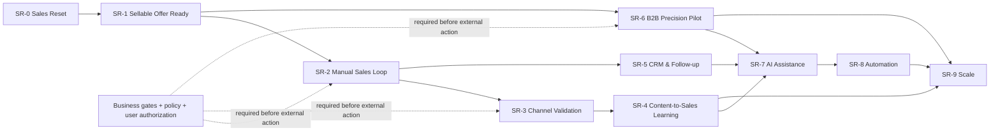

# Sales Execution Phases｜详细分阶段执行手册

- **日期**：2026-08-28
- **总规则**：以下阶段是现实动作的顺序，不是自动执行授权。`supplier_fact_missing` 不阻断规划，却阻断公开酒类行动、报价、收款、订单和履约。

## 1. 依赖图

可并行：SR-1 中不涉及客户资料的证据整理与 SR-0 文档同步；SR-3 的**只读政策核验**与 SR-5 的内部 CRM 设计。不可并行：真实渠道测试、B2B 接触、AI/自动化和扩张均依赖前序的业务/漏斗证据。

## 2. SR-0｜Sales Reset

| 字段 | 定义 |
|---|---|
| Goal / Why now | 将北极星、渠道角色、指标和停止线从系统完成度改为销售结果。 |
| Entry / business problem | 用户 P0 已明确；旧规划存在 AI-first 与 TikTok-only 范围。 |
| Inputs | 当前 GitHub `main`、工程/业务审计、用户 P0。 |
| Actions | 更新事实文件、战略文档、机制包与工程路线的 `SUPERSEDED` 说明。 |
| AI / human / supplier / channel role | AI 无；人工审计与决策同步；供应链无新事实；不发生渠道动作。 |
| Technical work / data | 文档、链接、版本、Git 证据；不改业务代码。 |
| Metrics / acceptance | 核心文档互相一致、状态分层、无外部动作。 |
| Blocked if / fallback | GitHub 事实不可读则 `github_fact_source_unreadable`；保守只读报告。 |
| Exit / unlock / not build | `planning_ready=true`；解锁 SR-1；不建新 adapter/Agent。 |

动作级清单：`A1` Codex 读取 `origin/main`（Output：事实矩阵；Done：remote/文件可读）；`A2` 用户/负责人审阅北极星（Output：P0 落库；Done：决策记录）；`A3` Codex 运行文档/机制验证（Output：验证报告；Done：通过或明确阻断）。

## 3. SR-1｜Sellable Offer Ready

| 字段 | 定义 |
|---|---|
| Goal / Why now | 把“可销售”从假设变成可审计输入；没有 Offer，内容和获客没有可转化对象。 |
| Entry / business problem | `planning_ready=true`；当前 SKU、价格、库存、资质、账号、收款、履约仍未知。 |
| Inputs | 供应链书面 SKU/规格/素材、价格与有效期、库存/补货、主体/许可/授权、收款、配送/售后和负责人。 |
| Actions | 人工收集、版本化、核验缺口；形成一个已批准的最小 Offer 及禁止表达清单。 |
| AI / human / supplier / channel role | AI 只整理缺口；供应链确认事实；人工审核；无公开渠道。 |
| Technical work / data | 优先人工 evidence register；真实资料进入私有受控路径时才考虑既有 ingestion。 |
| Metrics / acceptance | 每个 business gate 有来源、日期、owner、有效期与决定；缺失显式列为 `BLOCKED`。 |
| Blocked if / fallback | 缺任何关键证据即停止 SR-2 外部动作；继续供应链补件。 |
| Exit / unlock / not build | `business_ready=true` 只针对定义的 Offer；解锁 SR-2；不建付款/库存/电商系统。 |

动作级清单：`A1` 供应链提交资料（Output：私有 evidence）；`A2` 人工判定 Offer（Output：批准/拒绝/缺口）；`A3` Codex 生成无敏感缺口报告（Metric：关键证据覆盖）；`A4` 用户确认仅在全部门槛满足后授权渠道试点。

## 4. SR-2｜Manual Sales Loop

| 字段 | 定义 |
|---|---|
| Goal / Why now | 以最少技术跑通一个 Offer、一个入口、一名 owner 的人工销售闭环。 |
| Entry / business problem | 指定 Offer `business_ready`，渠道和用户外部执行授权齐备。 |
| Inputs | 已核验 Offer、账号/政策、CTA、询盘入口、销售 SOP、订单交接/履约 owner。 |
| Actions | 发布/展示仅在授权范围内；人工响应、资格判断、记录下一步、报价前复核、订单交接。 |
| AI / human / supplier / channel role | 人工销售主导；供应链确认可售/订单/履约；AI 仅草稿；一个渠道 + 一个入口。 |
| Technical work / data | 受控最小 CRM 表、来源/内容 ID、人工 interaction 与 outcome 记录。 |
| Metrics / acceptance | 可追踪首响、合格询盘、follow-up、Offer、订单/交接；一个完整案例不等于规模验证。 |
| Blocked if / fallback | 任一事实/授权失效即暂停公开动作；回内部草稿/资料收集。 |
| Exit / unlock / not build | 获得可复盘真实数据后解锁 SR-3/5；不接自动客服/支付/订单 API。 |

动作级清单：`A1` 用户核验账号与 CTA；`A2` 人工销售按 SOP 回复；`A3` 每次互动登记 owner/next action；`A4` 供应链书面确认订单交接；`A5` 每周复盘丢失原因。

## 5. SR-3｜Channel Validation

| 字段 | 定义 |
|---|---|
| Goal / Why now | 比较候选渠道是否产生可归因的合格询盘，而非同时运营多个平台。 |
| Entry / business problem | SR-2 有可售 Offer、单一承接和最小记录。 |
| Inputs | 渠道角色矩阵、政策/账号核验、同一 Offer、内容假设、观察窗口。 |
| Actions | 每次仅测试一个触点/受众/CTA 变量；记录 reach→inquiry→outcome。 |
| AI / human / supplier / channel role | AI 可协助变体草稿；人工发布/审核/回复；供应链只维持 Offer 事实。 |
| Technical work / data | 轻量 attribution；不自动分发、不买广告、不扩展 API。 |
| Metrics / acceptance | 指定窗口内可比较的 qualified inquiry / conversation / offer evidence。 |
| Blocked if / fallback | 平台政策或项目授权未知则不启动该渠道；优先已核验触点。 |
| Exit / unlock / not build | 有证据的渠道优先级；解锁 SR-4；不建多渠道管理平台。 |

动作级清单：`A1` 明确测试假设；`A2` 人工核验政策；`A3` 带稳定 ID 发布/记录；`A4` 复盘到下游而非只看播放；`A5` 决定 keep/deprioritize。

## 6. SR-4｜Content-to-Sales Learning

| 字段 | 定义 |
|---|---|
| Goal / Why now | 建立内容假设到询盘/订单结果的反馈循环。 |
| Entry / business problem | 至少一个渠道有可归因 inquiry 数据。 |
| Inputs | content ID、hook、受众、CTA、渠道、询盘和 outcome 记录。 |
| Actions | 对比内容/受众/CTA，保留让合格询盘增加的假设，停止只带来虚荣指标的内容。 |
| AI / human / supplier / channel role | AI 提供变体和摘要；人工决定选题/发布；供应链核实 Offer。 |
| Technical work / data | 把 `technical_qc/content_qc/business_qc` 加入内容审查。 |
| Metrics / acceptance | 可回答“哪类内容真正带来合格客户”，不足时明确归因未知。 |
| Blocked if / fallback | 无可售 Offer/归因数据则回 SR-2/3。 |
| Exit / unlock / not build | 已知一个可重复测试的内容假设；解锁 SR-7；不先建视频工厂。 |

动作级清单：`A1` 记录内容假设；`A2` 记录每次内容/CTA；`A3` 关联询盘/销售结果；`A4` 人工月度复盘；`A5` 决定新一轮实验。

## 7. SR-5｜CRM & Follow-up Stabilization

| 字段 | 定义 |
|---|---|
| Goal / Why now | 当真实询盘出现后，减少漏跟进并让销售负责人知道下一步。 |
| Entry / business problem | SR-2 已有多次需跟进的询盘或人工表格开始失效。 |
| Inputs | 合法最小客户资料、阶段定义、owner、DNC/隐私规则、next action SOP。 |
| Actions | 固化阶段、每日待办、失单原因、交接与最小 retention。 |
| AI / human / supplier / channel role | AI 可提示/摘要；人工负责更新/行动；供应链处理 Offer/履约事实。 |
| Technical work / data | 先轻量 CRM；只有痛点被证实才复用/扩展现有 CRM domain。 |
| Metrics / acceptance | 到期 follow-up 完成率、漏回复、stage aging、失单原因可见。 |
| Blocked if / fallback | 无真实询盘、无数据处理依据或 owner 不明，则保持手工最小记录。 |
| Exit / unlock / not build | 一个稳定人工漏斗；解锁 SR-7；不接第三方 CRM。 |

动作级清单：`A1` 定义 stage/owner；`A2` 记录 next action；`A3` 每日人工 review；`A4` DNC/删除请求立即升级；`A5` 用数据决定是否工程化。

## 8. SR-6｜B2B Precision Pilot

| 字段 | 定义 |
|---|---|
| Goal / Why now | 低频验证高匹配企业是否形成合规、可管理的销售机会。 |
| Entry / business problem | SR-1 Offer 可售；B2B 假设存在且来源/联系人处理/授权已单独通过。 |
| Inputs | approved source、company criteria、DNC/retention、人工 reviewer、联系/发送授权、B2B Offer。 |
| Actions | company-only discovery → 人工企业验证 → 合规 contactability → 单次审批沟通 → reply/机会记录。 |
| AI / human / supplier / channel role | AI 仅摘要/草稿；人工研究/审核/发送/回复；供应链确认样品/报价/履约。 |
| Technical work / data | 私有 provenance、最小 CRM、人工 outbox；不默认 crawler 或 sender。 |
| Metrics / acceptance | valid company、qualified company、contactable、reply、meeting/inquiry、opportunity；不看 page count。 |
| Blocked if / fallback | 来源条款、联系人依据、DNC/retention、用户授权、Offer 缺一即停；回人工 research。 |
| Exit / unlock / not build | 有可复盘 B2B 机会数据；解锁 SR-7；不做批量爬取/群发。 |

动作级清单：`A1` 明确账户标准；`A2` 逐来源审批；`A3` 公司级验证；`A4` 人工批准每次 contact；`A5` 记录回复与机会；`A6` 小样本复盘是否继续。

## 9. SR-7｜AI Assistance

| 字段 | 定义 |
|---|---|
| Goal / Why now | 只把已测量、重复且人工痛苦的动作做成 AI 辅助。 |
| Entry / business problem | SR-4/5/6 产生真实基线，且人工瓶颈有证据。 |
| Inputs | baseline、接受率/质量标准、事实锁、人工兜底、停止线。 |
| Actions | 先做 draft、摘要、提醒、分析小 probe，与人工基线对比。 |
| AI / human / supplier / channel role | AI 建议；人工批准/执行；供应链仍是业务事实唯一权威。 |
| Technical work / data | 可替换 port、审计、零外部动作；不先引入 Agent 框架。 |
| Metrics / acceptance | 节省时间或提高合格率，且风险不升高。 |
| Blocked if / fallback | 无基线/可测 KPI 即 `DEFER`；回手工 SOP。 |
| Exit / unlock / not build | 一个被证明有效的 assistance；可评估 SR-8；不自主发信/报价。 |

动作级清单：`A1` 人工记录重复动作与耗时（Input：SR-4/5/6 实际记录；Metric：baseline）；`A2` Codex/AI 仅产出受控建议（Output：draft/summary）；`A3` 人工接受/修订/拒绝（Metric：acceptance 与风险）；`A4` 对比基线并决定 keep/improve/stop（Done：有测量结论）。

## 10. SR-8｜Automation

| 字段 | 定义 |
|---|---|
| Goal / Why now | 对已证明稳定、低风险、重复的流程降低人工成本。 |
| Entry / business problem | SR-7 有净收益；输入/输出、异常、审批、回退可定义。 |
| Inputs | 稳定 SOP、量化节省、权限、审计、人工 override、policy proof。 |
| Actions | 单一自动化小范围 rollout，记录异常、人工介入和收益。 |
| AI / human / supplier / channel role | 自动化只能做批准的重复步骤；人工保留外部动作和异常决策。 |
| Technical work / data | deterministic workflow 优先；必要时才评估 Agent/LangGraph。 |
| Metrics / acceptance | 净节省时间、错误率、人工复核率与业务指标不劣化。 |
| Blocked if / fallback | 条件不稳定、异常不可恢复、合规不明即不自动化。 |
| Exit / unlock / not build | 可回退的窄自动化；解锁 SR-9；不做全自动销售系统。 |

动作级清单：`A1` 定义单一重复动作与异常路径（Input：已验证 SOP）；`A2` 先实现可回退的 deterministic workflow（Output：内部 automation probe）；`A3` 人工审查异常/外部前置（Metric：节省时间、错误、介入）；`A4` 停止或扩大前复核政策与业务结果（Done：净收益成立）。

## 11. SR-9｜Scale

| 字段 | 定义 |
|---|---|
| Goal / Why now | 在被验证的 Offer、渠道、履约和单位经济上谨慎扩张。 |
| Entry / business problem | 多个真实周期证明合格询盘、成交、履约和反馈可持续。 |
| Inputs | 渠道 ROI、库存/履约容量、合规、预算、客服和售后能力。 |
| Actions | 扩渠道/城市/SKU/内容频率前逐项 capacity 与政策复核。 |
| AI / human / supplier / channel role | AI/自动化只复制已证明做法；人工/供应链承担扩大后的质量与责任。 |
| Technical work / data | 仅扩已验证瓶颈；不因规模想象预建平台。 |
| Metrics / acceptance | 收入、毛利、履约、投诉、复购、渠道 ROI、人工成本共同达标。 |
| Blocked if / fallback | 库存、资金、许可、履约、售后或质量任一不足即停止扩张。 |
| Exit / unlock / not build | 由用户另行定义；不预设广告/达人/批量自动化。 |

动作级清单：`A1` 人工复核渠道/Offer/履约证据（Input：多个真实周期）；`A2` 定义单一扩张变量（城市、SKU 或渠道）；`A3` 小范围执行并记录收入、毛利、履约、投诉和复购（Output：scale decision）；`A4` 用户决定继续/暂停/回退（Done：跨层指标与业务闸门同时成立）。
