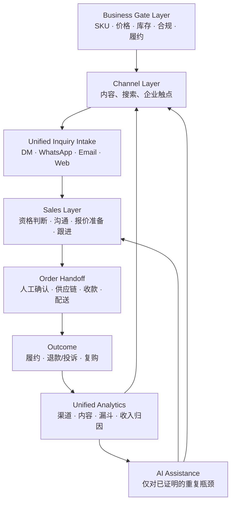

# Sales-First Master Plan｜销售优先总体规划

- **日期**：2026-08-28
- **状态**：`CONFIRMED`（本轮 P0 已落库的项目方向）；所有商品、合规、账号、平台与履约事实仍以 `docs/project/BUSINESS_STATUS.md` 的逐项证据为准。
- **权威性**：本文件是汾酒尼泊尔的业务优先总规划。它替代“完成 AI Native Sales OS”作为项目北极星；不会删除或否定既有安全、隔离、审批与审计工程资产。

## 1. 执行判断

项目的根本错位是：已把可审计的内部 AI/数据系统建设得远快于可销售商品、客户承接、销售推进和履约闭环。新的核心不是“完成系统”，而是在业务闸门满足后，以最少技术和明确人工责任，反复验证 **渠道触达 → 询盘 → 沟通 → 订单 → 履约交接 → 反馈** 的真实销售闭环。

因此，旧 `TikTok-only` 当前业务范围，以及 Phase 0–8 工程蓝图作为**业务主路线**的地位均为 `SUPERSEDED`（替代日期：2026-08-28；来源：用户本轮 P0）。TikTok 和既有工程合同仍是可复用资产；它们不是自动获客、自动销售或商业就绪的证明。

## 2. 当前已确认事实与不做事项

| 事实 | 状态 | 对本规划的含义 |
|---|---|---|
| Phase 0–7 已实现大量 local/synthetic contract、审批、审计、DNC、草稿、QC 与 fake adapter | `CONFIRMED` | 保留为 fail-closed 底座；不能升级为真实客户、真实发送或真实订单。 |
| `external_execution_allowed=false`、发送/发布/报价/付款/订单默认拒绝 | `CONFIRMED` | 本轮不改；实际销售只能在每项业务闸门、平台政策和用户授权都满足后另行激活。 |
| 真实 SKU、价格、库存、合法主体/授权、账号权限、收款、配送、售后等证据 | `UNKNOWN / BLOCKED` | 阻断公开商品展示、报价、收款、订单与履约，但不阻断本规划。 |
| TikTok、Instagram、Facebook、WhatsApp、官网和企业邮箱的项目可用性 | `UNKNOWN` | 本文件只定义渠道角色；不把技术能力或账号存在写成项目已获授权。 |
| B2B 企业发现与 contactability | `PLANNED_ONLY` | 只能是有合规依据、人工审核的低频实验；不是当前销售发动机。 |

本轮不做：业务代码大重构、真实发布/广告/消息/报价/付款/订单、导入真实客户资料、猜测 SKU/价格/许可/账号能力，或把任何平台 API 存在视为项目可用。

## 3. 新北极星与成功定义

**新北极星**：在供应链、当地合法销售、平台规则、账号权限和履约责任均具备可回读书面证据后，用一个最小、可核验、可重复的线上销售闭环，验证汾酒在尼泊尔能从获客触点产生合格询盘，由人工推进为订单并完成供应链交接；AI、视频、CRM、研究和自动化仅在明确提高该闭环的速度、质量或转化时进入。

**不是成功**：文档生成、测试通过、内容生成成功、crawl/page/company 数量、CRM 字段数量、模型接入、Git 提交或远端回读。

**成功层级必须分开**：

| 状态 | 定义 |
|---|---|
| `planning_ready` | 本文件及配套矩阵已一致，事实与假设分层。 |
| `engineering_ready` | 所需内部工具的具体任务、数据边界和验证已完成。 |
| `business_ready` | 所有 SKU、资质、主体、价格、库存、账号、支付及履约业务闸门都有当前书面证据。 |
| `channel_ready` | 指定渠道已由责任人完成账号/政策/承接路径核验，并获本次执行授权。 |
| `sales_loop_validated` | 有可审计的真实询盘、人工推进、订单和履约交接证据；不是单纯流量。 |
| `automation_ready` | 重复人工动作已测量，自动化较人工有明确净收益且安全边界可验证。 |
| `scale_ready` | 一个或多个渠道和履约路径已稳定满足继续投入的商业标准。 |

## 4. 销售漏斗与统一架构



漏斗状态由两个主链分别管理，最后进入同一个 `Customer / Interaction / Opportunity / Order Outcome` 关系模型：

| 主链 | 最小状态 | 不可替代的人工职责 |
|---|---|---|
| B2C inbound | `DISCOVERED → ENGAGED → INQUIRY → QUALIFIED → CONVERSATION → OFFER_PENDING → OFFERED → ORDER_PENDING → ORDER_CONFIRMED → FULFILLMENT → COMPLETED / LOST / DNC` | 判断可售范围、回复、报价、订单确认和交接。 |
| B2B outbound | `TARGET_ACCOUNT → VERIFIED_COMPANY → CONTACTABLE_WITH_BASIS → CONTACTED → CONVERSATION → NEED_CONFIRMED → OFFER_PENDING → OFFERED → NEGOTIATION → ORDER_PENDING → ORDER_CONFIRMED / LOST / DNC` | 核验企业、联系人处理依据、每次外联、报价与谈判。 |

`crawl` 只可能帮助 B2B 的 `TARGET_ACCOUNT → VERIFIED_COMPANY`，不等于客户、联系人、会话或销售机会。

## 5. 渠道与 AI 的决定规则

渠道不是独立项目。采用 **一个内容生产中心 → 多渠道分发 → 统一询盘承接 → 统一 CRM/下一步动作 → 统一销售数据**。具体渠道角色见 [CHANNEL_ROLE_MATRIX.md](CHANNEL_ROLE_MATRIX.md)。外部官方资料已确认 TikTok/Meta/Instagram/WhatsApp/Gmail 的部分技术能力与限制、以及尼泊尔酒类许可框架；本项目的账号、许可、地域、数据处理和执行授权仍为 `UNKNOWN / BLOCKED`。尤其 WhatsApp 不得承接酒类交易，Meta commerce channels 不得承接酒类销售；详见 [EXTERNAL_POLICY_AND_AUTHORIZATION_MATRIX.md](EXTERNAL_POLICY_AND_AUTHORIZATION_MATRIX.md)。

任何 AI、视频、CRM、爬虫或自动化进入主路线前，必须写出：

```text
Capability → sales funnel stage → metric → current manual baseline → target → measurement window → Keep / Improve / Stop
```

回答不了下列四问即 `DEFER`：它改善漏斗哪一步？影响哪个指标？不做是否影响当前成交？人工替代成本是多少？详细准则见 [SALES_EFFECT_SCORECARD.md](SALES_EFFECT_SCORECARD.md)。

## 6. Minimum Viable Sales Loop（最小销售闭环）

在 `business_ready=true` 与指定 `channel_ready=true` 之前，本段只能是执行设计，不能启动真实外部动作。

1. **明确一个可售 Offer**：供应链提供已批准 SKU、规格、价格/有效期、库存、合法销售/品牌证据、支付与履约责任人；缺任一项即 `BLOCKED`。
2. **选择一个内容触点和一个承接点**：例如经政策与账号核验后的 TikTok 内容或官网页面，唯一 CTA 指向受控 WhatsApp/DM/Web 表单之一；不用多平台并行掩盖归因。
3. **人工承接与记录**：指定销售负责人、首响目标、资格判断问题、事实锁定的商品资料和下一步日期；CRM 初期可以是受控轻量表单/表格，不先建复杂系统。
4. **报价与订单交接**：只在当前事实、授权和法律/平台边界都允许时，由人工给出；订单由供应链确认付款、库存和履约后才记为 `ORDER_CONFIRMED`。
5. **最小数据集**：`channel_source`、`content_id`、`inquiry_at`、`customer_type`、`stage`、`owner`、`next_action_at`、`offer_ref`、`outcome`、`order_ref`（均使用最小化、受控字段）。
6. **判定**：第一笔订单必须同时有客户同意、订单/付款的业务证据和供应链履约交接；仅收到消息、草稿或意向均不是订单。

## 7. 分阶段路线和停止线

新路线依次为 `SR-0 Sales Reset → SR-1 Sellable Offer Ready → SR-2 Manual Sales Loop → SR-3 Channel Validation → SR-4 Content-to-Sales Learning → SR-5 CRM & Follow-up → SR-6 B2B Precision Pilot → SR-7 AI Assistance → SR-8 Automation → SR-9 Scale`。每阶段的动作、输入、验收、阻断与解锁在 [SALES_EXECUTION_PHASES.md](SALES_EXECUTION_PHASES.md) 中定义；阶段之间不得以“系统完成”跳过业务证据。

共用停止线：

- `supplier_fact_missing`：停止公开展示、报价、付款、订单、履约；继续做内部规划和资料缺口收集。
- 指定渠道在预先定义的观察窗口内未产生合格询盘：不扩张该渠道，先回内容、受众、Offer 或承接质量排查。
- B2B 小样本无有效回复：停止扩大企业发现/crawler，复核来源、目标账户、价值主张和外联合规，而不是加大抓取。
- AI 或 CRM 不能提高已测量的人工效率或漏斗质量：回退到人工/轻量工具，保持 `DEFER`。
- 任一政策、账号、资质、付款、订单或履约事实失效：关闭对应执行路径，回到 Business Gate Layer。

数值阈值在没有真实基线时写为 `TO_BE_VALIDATED`，不得编造。

## 8. 目标工程影响

当前代码不需要为“整洁”而重构。现有资产处理详见 [CURRENT_SYSTEM_REUSE_MATRIX.md](CURRENT_SYSTEM_REUSE_MATRIX.md)：安全合同、来源/事实 provenance、DNC、审批、审计、人工接管和内部 QC 为 `KEEP`；CRM、内容、视频、分析和客户发现为 `REFOCUS`；真实 provider、Agent/LangGraph、自动化、支付和订单实现均非当前工程任务。

所有未来实现必须先补独立任务的实现设计层：`primary_route`、`fallback_route`、`capability_status`、`probe_required`、`allowed_codex_autonomy`、`forbidden_codex_guessing`、`required_inputs`、`required_outputs`、`execution_entrypoints`、`validation_commands` 与 `blocked_if_missing`。缺失时为 `blocked_need_implementation_design_layer`。

## 9. 导航

- [CURRENT_TO_TARGET_GAP_ANALYSIS.md](CURRENT_TO_TARGET_GAP_ANALYSIS.md)：当前状态矩阵、错位根因与差距。
- [SALES_SYSTEM_TARGET_ARCHITECTURE.md](SALES_SYSTEM_TARGET_ARCHITECTURE.md)：目标数据/系统架构、人工与 AI 边界。
- [SALES_EXECUTION_PHASES.md](SALES_EXECUTION_PHASES.md)：动作级阶段执行手册和依赖图。
- [CHANNEL_ROLE_MATRIX.md](CHANNEL_ROLE_MATRIX.md)：每个触点的角色、承接、政策与人工边界。
- [SALES_EFFECT_SCORECARD.md](SALES_EFFECT_SCORECARD.md)：业务结果、归因和 AI 效果指标。
- [CURRENT_SYSTEM_REUSE_MATRIX.md](CURRENT_SYSTEM_REUSE_MATRIX.md)：`KEEP / REFOCUS / DEFER / RETIRE / NEW` 判断。
- [fenjiu/FENJIU_EXECUTION_PLAYBOOK.md](fenjiu/FENJIU_EXECUTION_PLAYBOOK.md)：汾酒从 FJ-1 到规模化的独立行动、Offer、渠道、SOP 与停止线。
- [fenjiu/FENJIU_CONTENT_PLAYBOOK.md](fenjiu/FENJIU_CONTENT_PLAYBOOK.md)：汾酒 AI iPhone Natural Look、内容卡、Hook、CTA 与内容归因规则。
- [seafood/SEAFOOD_EXECUTION_PLAYBOOK.md](seafood/SEAFOOD_EXECUTION_PLAYBOOK.md)：海鲜 Supplier SF-S1 + User SF-U0–U8 双工作流总入口。
- [seafood/SEAFOOD_CONTENT_PLAYBOOK.md](seafood/SEAFOOD_CONTENT_PLAYBOOK.md)：海鲜 B2B/B2C 内容卡、AI 视觉边界与数据合同。
- [seafood/SEAFOOD_ONLINE_ACQUISITION_PLAYBOOK.md](seafood/SEAFOOD_ONLINE_ACQUISITION_PLAYBOOK.md)：用户 SF-U0–U8 线上获客日常主手册、First ICP/Route、成本与停止线。
- [seafood/SEAFOOD_LEAD_HANDOFF_CONTRACT.md](seafood/SEAFOOD_LEAD_HANDOFF_CONTRACT.md)：用户 Qualified Lead → 供应链销售，以及 Supplier Outcome → 用户优化的接口。
- [DUAL_BUSINESS_LINE_STAGE_GATE_MATRIX.md](DUAL_BUSINESS_LINE_STAGE_GATE_MATRIX.md)：双线“现在做什么 / NOT NOW / 解锁条件”。
- [DUAL_BUSINESS_LINE_KPI_SCORECARD.md](DUAL_BUSINESS_LINE_KPI_SCORECARD.md)：双线 Output / Funnel / Decision 指标及建议的初始测试阈值。
