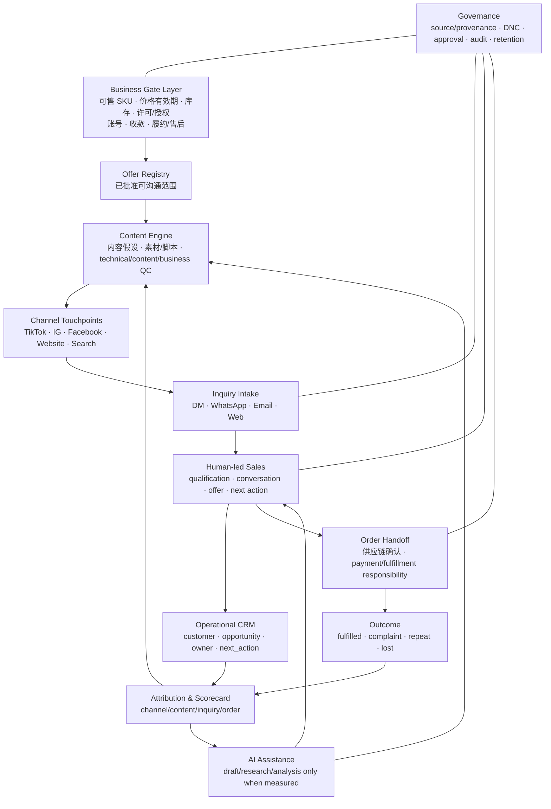
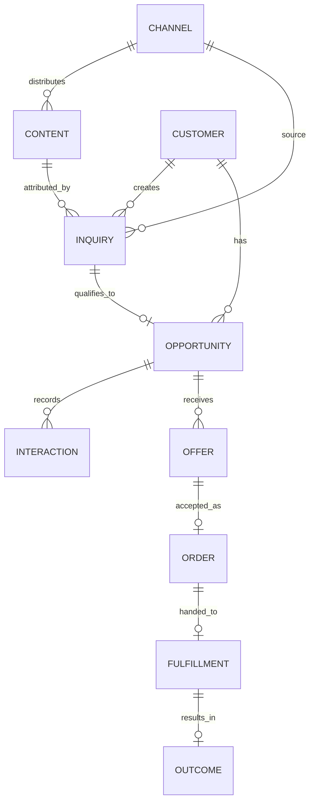

# Sales System Target Architecture｜销售系统目标架构

- **日期**：2026-08-28
- **状态**：`PLANNING_READY`；不是已部署系统，也不解除任何 `business_gates`。

## 1. 架构目标

目标是让每笔有效询盘、每次人工销售动作、每个 Offer 与每个订单结果都能回到来源渠道和内容/客户假设；不是建立一个独立于销售之外的大型 AI 平台。



## 2. 层与责任

| 层 | 负责什么 | 现在的最小实现 | 禁止替代 |
|---|---|---|---|
| Business Gate | 判定什么可售、可说、可报价、可履约 | 当前书面证据清单与人工审核 | 不能用模型、内容、测试或订单意向补齐。 |
| Offer Registry | 仅提供事实锁定、有效期内的商品资料 | 审批后人工版本表；既有 Truth Center 可复用 | 不自行编造价格、库存或资质。 |
| Channel | 让客户看到 Offer 并形成可归因进入 | 一次只验证一个主触点和一个 CTA | 不把平台存在写成已获准运营。 |
| Inquiry Intake | 收集主动进入的询盘并分配 owner | 单一受控入口、人工收件与最小记录 | 不自动承诺、报价或处理未授权个人数据。 |
| Human-led Sales | 资格判断、对话、下一步、Offer 与交接 | 人工 SOP + 最小 CRM | AI 不能自主发信、承诺、谈判或确认订单。 |
| CRM | 显示“谁、在哪个阶段、谁负责、下一步何时做” | 轻量表格/受控字段；现有 domain 后置复用 | 不是数据仓库或真实数据的无边界容器。 |
| Order Handoff | 把已确认订单交给正确的供应链/付款/履约责任 | 人工确认和交接记录 | 不创建付款、物流或退款事实。 |
| Attribution | 回答哪些渠道/内容带来合格询盘和收入 | content/source ID + 人工 outcome 记录 | 不把 views 直接当成商业效果。 |
| AI/Automation | 提升已证明重复动作的效率/质量 | draft、摘要、提醒、分析建议 | 不取代闸门、人类批准或真实外部行为。 |

## 3. 统一数据关系



最小可记录字段只有：稳定 reference、业务线、来源渠道、内容/活动 reference、时间、当前阶段、owner、下一步、受控 Offer reference、结果。真实电话、邮箱、消息正文、付款或个人资料只能在有合法依据、最小化存储和访问控制的私有系统内处理，不能进入 Git、fixture、普通日志或策略文档。

## 4. 内容、视频与 AI 的新验收

| 层 | 问题 | 通过条件 |
|---|---|---|
| `technical_qc` | 内容是否可正常观看/读取？ | 规格、字幕、声音等适配目标渠道。 |
| `content_qc` | 是否准确、适合受众并符合已核验政策？ | 事实锁定、品牌/合规人工审核。 |
| `business_qc` | 是否帮助目标客户进入下一步？ | 可归因 CTA、受众/Hook 假设、询盘或更下游证据。 |

视频生成、AI 选题、AI 客服草稿、AI lead score 和 AI 分析都必须连接到 [SALES_EFFECT_SCORECARD.md](SALES_EFFECT_SCORECARD.md) 的基线与测量窗口。无法测量时保留为 `DEFER`。

## 5. 人工 / AI / 供应链边界

| 角色 | 必须负责 | 不能替代 |
|---|---|---|
| 用户 | 业务优先级、对外执行授权、渠道操作、销售策略最终判断 | 供应链事实或当地专业合规意见。 |
| 供应链 | 商品、价格、库存、许可/品牌授权、收款、配送、售后与结算事实 | 用户的内容运营或客户沟通。 |
| 人工销售 | 回复、资格判断、报价前核实、订单确认、交接与异常升级 | 平台/法律许可判断。 |
| Codex | 受控资料、工具、验证、Git、草稿与分析 | 自主外发、创建订单、猜测业务事实。 |
| AI | 草稿、分类、提醒、汇总、分析建议 | 认可事实、批准高风险动作、发送、谈判、付款或履约。 |
| 平台/主管机关 | 账户、消息、广告/酒类政策与许可的最终约束 | 任何项目内技术/文件。 |

## 6. 现有工程影响

| 目录/资产 | 目标影响 | 本轮决定 |
|---|---|---|
| `apps/`, `core/`, `modules/`, `workflows/`, `migrations/`, `tests/`, `fixtures/` | 保留边界与测试；未来只为已证明漏斗瓶颈扩展 | 不重命名、不合并、不大重构。 |
| `adapters/crawl`, `adapters/support`, `adapters/video` fake | 保留零外部作用的安全测试基线 | 不把 fake 换成真实 provider。 |
| `adapters/ai`, `adapters/crm` | 当前无真实实现 | 不因“架构完整”而补建。 |
| `docs/implementation/` Phase 0–8 | 技术资产和历史路线 | 不再作为业务优先级排序；后续任务由 Sales-First 阶段解锁。 |

任何新工程卡必须有：

```text
primary_route / fallback_route / capability_status / probe_required /
allowed_codex_autonomy / forbidden_codex_guessing / required_inputs /
required_outputs / execution_entrypoints / validation_commands / blocked_if_missing
```

缺字段或无可测销售问题时，结论为 `blocked_need_implementation_design_layer` 或 `DEFER`。
